## Table of Contents

- [0. Front Matter](#0-front-matter)
  - [0.1 Title, version, publish date](#01-title-version-publish-date)
  - [0.2 Audience: Investors / Traders](#02-audience-investors--traders)
  - [0.3 Disclaimers](#03-disclaimers)
  - [0.4 Key definitions](#04-key-definitions)

- [1. Vision & Market Problem](#1-vision--market-problem)
  - [1.1 Why most traders lose](#11-why-most-traders-lose)
  - [1.2 What Quant means in FUZE](#12-what-quant-means-in-fuze)
  - [1.3 Why Telegram-native matters](#13-why-telegram-native-matters)
  - [1.4 Product positioning boundaries](#14-product-positioning-boundaries)
    - [Analytics + Paper Simulation](#analytics--paper-simulation)
    - [Execution](#execution)
    - [Copy Trading](#copy-trading)

- [2. What FUZE Quant Platform Is](#2-what-fuze-quant-platform-is)
  - [2.1 One-line definition](#21-one-line-definition)
  - [2.2 Brain + Proof + Hands](#22-brain--proof--hands)
  - [2.3 What users get today](#23-what-users-get-today)
  - [2.4 What users get later](#24-what-users-get-later)

- [3. Who It’s For](#3-who-its-for)
  - [3.1 Active traders](#31-active-traders)
  - [3.2 Swing traders](#32-swing-traders)
  - [3.3 Semi-pro / community traders](#33-semi-pro--community-traders)
  - [3.4 Investor lens](#34-investor-lens)

- [4. Product Overview](#4-product-overview)
  - [4.1 Supported markets & venues](#41-supported-markets--venues)
  - [4.2 Modes explained](#42-modes-explained)
    - [Backtest](#backtest)
    - [Paper](#paper)
    - [Live](#live)
  - [4.3 Key features](#43-key-features)
  - [4.4 Feature gating](#44-feature-gating)

- [5. Telegram Mini App UX](#5-telegram-mini-app-ux)
  - [5.1 UX principles](#51-ux-principles)
  - [5.2 Navigation map](#52-navigation-map)
  - [5.3 Onboarding](#53-onboarding)
  - [5.4 Core screens](#54-core-screens)
  - [5.5 Alerts UX](#55-alerts-ux)

- [6. Trust & Performance Reporting](#6-trust--performance-reporting)
  - [6.1 What trust means](#61-what-trust-means)
  - [6.2 Standard metrics](#62-standard-metrics)
  - [6.3 Regime breakdown](#63-regime-breakdown)
  - [6.4 No-mixing rule](#64-no-mixing-rule)
  - [6.5 Realism assumptions](#65-realism-assumptions)
  - [6.6 Report identity](#66-report-identity)
  - [6.7 Interpretation guide](#67-interpretation-guide)

- [7. How It Works](#7-how-it-works)
  - [7.1 Strategy templates & versions](#71-strategy-templates--versions)
  - [7.2 Strategy instance lifecycle](#72-strategy-instance-lifecycle)
  - [7.3 Paper-first workflow](#73-paper-first-workflow)
  - [7.4 Risk profiles](#74-risk-profiles)
  - [7.5 Data health protections](#75-data-health-protections)
  - [7.6 Auditability](#76-auditability)

- [8. Safety, Risk Controls, and User Protection](#8-safety-risk-controls-and-user-protection)
  - [8.1 Built-in guardrails](#81-built-in-guardrails)
  - [8.2 Kill switch](#82-kill-switch)
  - [8.3 Perp-specific cautions](#83-perp-specific-cautions)
  - [8.4 Alerts safety](#84-alerts-safety)
  - [8.5 What FUZE does NOT do](#85-what-fuze-does-not-do)

- [9. Execution Module](#9-execution-module)
  - [9.1 Why execution is separate from proof](#91-why-execution-is-separate-from-proof)
  - [9.2 BYOK concept](#92-byok-concept)
  - [9.3 Reconciliation & trade logs](#93-reconciliation--trade-logs)
  - [9.4 Failure handling](#94-failure-handling)
  - [9.5 Path from Paper to Live](#95-path-from-paper-to-live)

- [10. Credits Economy and Monetization](#10-credits-economy-and-monetization)
  - [10.1 What Credits are](#101-what-credits-are)
  - [10.2 Stars conversion](#102-stars-conversion)
  - [10.3 What Credits pay for](#103-what-credits-pay-for)
  - [10.4 Fair-use limits](#104-fair-use-limits)
  - [10.5 User levels](#105-user-levels)

- [11. Referral Program and Community Growth](#11-referral-program-and-community-growth)
  - [11.1 Affiliate model overview](#111-affiliate-model-overview)
  - [11.2 How payouts work](#112-how-payouts-work)
  - [11.3 Anti-fraud rules](#113-anti-fraud-rules)
  - [11.4 Share-to-earn guidelines](#114-share-to-earn-guidelines)

- [12. Leaderboards and Social Proof](#12-leaderboards-and-social-proof)
  - [12.1 What the leaderboard measures](#121-what-the-leaderboard-measures)
  - [12.2 Mode separation](#122-mode-separation)
  - [12.3 Validation](#123-validation)
  - [12.4 Abuse prevention](#124-abuse-prevention)

- [13. Go-To-Market and Distribution](#13-go-to-market-and-distribution)
  - [13.1 Why Telegram is the channel](#131-why-telegram-is-the-channel)
  - [13.2 Trader acquisition loop](#132-trader-acquisition-loop)
  - [13.3 Community loops](#133-community-loops)
  - [13.4 Monetization model summary](#134-monetization-model-summary)

- [14. Roadmap](#14-roadmap)
  - [14.1 MVP](#141-mvp)
  - [14.2 Next 90 days](#142-next-90-days)
  - [14.3 Data pack expansions](#143-data-pack-expansions)
  - [14.4 Execution phase](#144-execution-phase)
  - [14.5 Copy trading](#145-copy-trading)
  - [14.6 Long-term vision](#146-long-term-vision)

- [15. Team, Operations, and Governance](#15-team-operations-and-governance)
  - [15.1 Team overview](#151-team-overview)
  - [15.2 Operating principles](#152-operating-principles)
  - [15.3 Admin oversight](#153-admin-oversight)
  - [15.4 Incident transparency](#154-incident-transparency)
  - [15.5 Governance](#155-governance)

- [16. Legal, Privacy, and Compliance](#16-legal-privacy-and-compliance)
  - [16.1 Privacy summary](#161-privacy-summary)
  - [16.2 Data retention](#162-data-retention)
  - [16.3 Signals vs execution positioning](#163-signals-vs-execution-positioning)
  - [16.4 User responsibilities and limitations](#164-user-responsibilities-and-limitations)

- [17. FAQs](#17-faqs)
  - [17.1 Is this a trading bot](#171-is-this-a-trading-bot)
  - [17.2 Why paper-first](#172-why-paper-first)
  - [17.3 How are results calculated](#173-how-are-results-calculated)
  - [17.4 What happens if data is missing](#174-what-happens-if-data-is-missing)
  - [17.5 Can I connect my exchange](#175-can-i-connect-my-exchange)
  - [17.6 How do credits work](#176-how-do-credits-work)
  - [17.7 How do referrals work](#177-how-do-referrals-work)
  - [17.8 Backtest vs Paper vs Live trust](#178-backtest-vs-paper-vs-live-trust)

- [18. Appendix](#18-appendix)
  - [18.1 Glossary](#181-glossary)
  - [18.2 Example report walkthrough](#182-example-report-walkthrough)
  - [18.3 Example user journeys](#183-example-user-journeys)
  - [18.4 Trust Snapshot template](#184-trust-snapshot-template)
  - [18.5 Change log](#185-change-log)

___

# 0. Front Matter

## 0.1 Title, version, publish date

**Title:** FUZE Quant Platform Whitepaper
**Subtitle:** Telegram-native quant research, paper simulation, and optional execution platform
**Version:** v1.0
**Publish date:** 2026-01-05 (Asia/Bangkok, GMT+7)
**Maintainer:** FUZE Team
**Scope note:** This is the public live version of the FUZE Quant Platform documentation, written for non-developers.

---

## 0.2 Audience: Investors / Traders

This whitepaper is designed for two reader groups:

**Traders and Web3 users**

* Understand what FUZE is, what it does, and what it does not do
* Learn the difference between Backtest, Paper, and Live results
* Learn how to interpret reports and metrics without guessing
* Understand safety controls, alerts, data health protections, and the credit system

**Investors**

* Understand the market problem and why “trust + proof” is the wedge
* See why Telegram-native distribution matters for growth efficiency
* Understand the product boundaries and compliance-aware roadmap
* Understand monetization mechanics, integrity controls, and what scales over time

This document intentionally avoids engineering-level details. Everything is explained in product and user terms.

---

## 0.3 Disclaimers

* **Not financial advice:** This document is for informational purposes only and does not constitute investment, legal, tax, or financial advice.
* **High risk:** Crypto assets and derivatives can be extremely volatile. You can lose part or all of your capital.
* **Backtest and Paper are simulations:** Results from Backtest and Paper modes are not the same as Live results. They are useful for learning and evaluation, but they are not guarantees.
* **Execution is separate and optional:** Live trading involves real orders. If enabled, it requires explicit user action and user-controlled exchange access. You are responsible for your trading decisions and outcomes.
* **No profit guarantees:** FUZE does not promise returns. Any performance shown is a measurement under a specific mode, time window, and assumptions.
* **Data and market conditions can change:** Market structure, liquidity, exchange behavior, and volatility evolve. Data disruptions and exchange outages can happen. FUZE includes protections, but no system can eliminate all risks.
* **Responsible use:** Use Paper-first by default, understand risk controls, and treat leverage with extra caution.

---

## 0.4 Key definitions

Below are the minimum definitions used throughout this whitepaper.

### Core mode definitions

* **Mode:** The truth boundary for behavior and results. FUZE separates outcomes by mode to prevent confusion.
* **Backtest:** Simulation over historical data using explicit assumptions (including a cost model).
* **Paper:** Real-time simulation driven by live market data, with simulated fills and accounting.
* **Live:** Real order execution on an exchange. Live results reflect actual fills and real market impact.

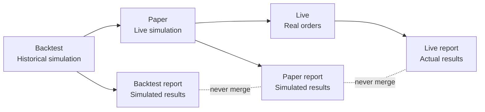

### Strategy and reporting definitions

* **Strategy template:** A reusable strategy design (the “idea + rules”), typically configurable with parameters.
* **Strategy version:** An immutable snapshot of a strategy at a point in time. If logic changes, a new version is created so results stay comparable.
* **Strategy instance:** Your personal run of a specific strategy version in a specific mode (Backtest, Paper, or Live).
* **Report:** A standardized performance output that summarizes results and includes identity details so the reader can interpret it correctly.
* **Report identity:** The metadata that makes a report interpretable: mode, strategy version, market, timeframe, date range, and assumptions.
* **No-mixing rule:** Results from different modes must not be blended into one performance number. Backtest, Paper, and Live are always separated.

### Market realism definitions

* **Cost model:** The assumptions used to account for trading frictions such as fees, slippage, and spread in simulated modes.
* **Regime:** A market condition category used for performance breakdown, typically bull, bear, and sideways.

### Safety and integrity definitions

* **Risk controls:** Guardrails that limit loss and exposure and help prevent runaway behavior during volatility.
* **Kill switch:** A safety stop that pauses or shuts down activity when conditions breach limits or integrity rules.
* **Data health:** A system assessment of market data quality (staleness, gaps, misalignment) used to warn users and pause or degrade simulations when needed.
* **Audit trail:** An immutable log of sensitive actions to support accountability and integrity.

### Economics and growth definitions

* **Credits:** A platform utility unit purchased via Telegram Stars and spent on platform usage.
* **Stars conversion:** 50 Stars = 1 Credit.
* **Ledger:** The record of credit mint, spend, refund, and reversal events.
* **Leaderboard:** A ranking surface based on eligible reports with integrity rules and mode separation.
* **Affiliate:** A share-to-earn and referral mechanism with anti-abuse and reversal logic.

> FUZE separates outcomes by mode so users don’t confuse simulation with reality.
> Backtest and Paper are designed for learning, validation, and habit formation.
> Live execution is optional and intentionally treated as a different truth category.
> Every report is meant to be interpretable without “trust me” narratives.
> If you remember one rule: never mix Backtest, Paper, and Live results.

---
# 1. Vision & Market Problem

FUZE Quant Platform exists to solve one core issue in retail crypto trading: most “strategy products” optimize for excitement and screenshots, not verification, realism, and survivability. FUZE takes the opposite approach—trust-first, mode-separated, and designed for active traders who need fast, controlled workflows.

---

## 1.1 Why most traders lose

Most active traders do not lose because they “lack indicators.” They lose because their trading systems lack **verification**, **realism**, and **survival discipline**. In practice, the same failure patterns repeat across signal groups, retail bots, and copy-paste strategies.

### Unproven edge

Many strategies are recycled indicator recipes (RSI/MACD/MA cross) with no proof of **after-cost** performance. When the same rule set becomes popular, any small edge often compresses or disappears.

### Misleading backtests

Backtests often look profitable but fail when used live because they contain hidden distortions:

* Look-ahead bias (future leakage in signals or indicators)
* Unrealistic fills (assuming perfect entry/exit, ignoring spread and slippage)
* Ignoring fees (and for perps, funding impacts)
* Overfitting to a single market regime
* Survivorship bias in selected windows/pairs

The result is “pretty but fake”—confidence built on assumptions that don’t survive reality.

### ROI-first dashboards hide survival risk

Many traders select strategies that “look profitable” but are fragile because the dashboard prioritizes ROI while hiding the risk profile that actually determines whether the strategy can survive:

* Max drawdown
* Worst day and worst week
* Exposure (time at risk)
* Tail behavior during crashes and volatility spikes

### Regime blindness

Crypto shifts between trending expansions, bear sell-offs, sideways chop, and volatility spikes. Most bots do not adapt or even warn when the regime changes, causing strategies to break precisely when traders need them most.

### Execution and operations are ignored

For short timeframes like 5m, outcomes are dominated by operational realities:

* Spread widening during volatility
* Slippage and thin liquidity
* Rate limits, downtime, degraded feeds
  A strategy that looks “accurate” on paper can still lose money if execution conditions are not modeled and monitored.

### Low trust and non-reproducible results

Many products don’t provide:

* Versioned strategy definitions
* Standardized cost assumptions
* Clear mode separation between backtest, paper, and live
  When those are missing, users cannot verify what they are following or buying.

---

## 1.2 What Quant means in FUZE

In FUZE, “Quant” does not mean mystery signals or magic indicators. It means a disciplined system where strategies are **measurable**, **reproducible**, and **survivable** under realistic costs and changing regimes.

FUZE organizes this idea as:

* **Brain**: strategy intelligence
* **Proof**: trust and verification
* **Hands**: execution (optional and strictly separated)

### Brain

The strategy layer is treated as a structured object that can be tested and audited:

* Strategies are structured and testable
* Signals have deterministic, auditable reasons
* Risk profiles and consistent sizing rules exist as first-class concepts

### Proof

The reporting layer exists to prevent misleading results and make strategies comparable:

* Reporting always includes survival metrics, not just ROI
* Results are broken down by regime (bull/bear/sideways) to reveal stability
* Cost assumptions (fees/slippage/spread) are explicit and transparent
* Strategy versioning is enforced: any logic change creates a new version with a new track record

### Hands

Execution is real trading and therefore must be treated as a different category:

* Execution requires stronger security and reconciliation
* Execution results must never be mixed with backtest or paper results
* Backtest and paper are the default and primary proof surfaces
* Live execution is an optional add-on and not required to benefit from the platform

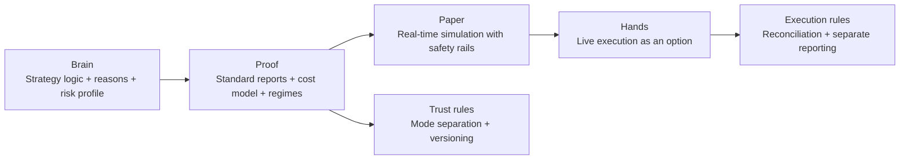

---

## 1.3 Why Telegram-native matters

FUZE is designed as a Telegram Mini App because the platform is built around **speed**, **habit**, and **controlled monitoring**—the daily reality of active traders.

### Fast workflow for active traders

The core workflow is optimized for rapid decision cycles:

* Discover strategies
* Validate with standardized evidence
* Run paper simulation by default
* Promote to execution only if the user explicitly chooses

### Alerts that are usable, not noisy

Telegram-native delivery supports a practical alert system with guardrails:

* Cooldowns to prevent spam
* Digest mode so traders can review signals in batches
* Quiet hours so the system respects attention and sleep
* Quotas and usage rules so alerts remain reliable at scale

### Clear safety controls in the same surface

Telegram-native UX keeps safety controls visible during real usage:

* Clear mode badges so users always know if they’re seeing Backtest, Paper, or Live
* Kill switch access for running instances
* Auto-pause reasons surfaced when risk or data health protections trigger

The goal is not just convenience. It’s to make correct behavior the default: paper-first, mode-aware, safety-visible.

---

## 1.4 Product positioning boundaries

FUZE enforces strict boundaries to protect trust. These boundaries are part of the product design, not marketing language.

### Analytics and Paper Simulation

**Purpose**

* Provide evidence and operational realism without placing real orders.

**Includes**

* Strategy discovery (templates and versions)
* Backtests with standardized reporting
* Real-time paper instances (signals with simulated fills)
* Risk controls and auto-pauses (data health and risk limits)
* Alerts and exports for monitoring and journaling
* Leaderboards derived from eligible, mode-labeled records

**Hard boundary**

* Paper results must be labeled as Paper and must not be marketed as Live.

### Execution

**Purpose**

* Place real orders on exchanges using user credentials, with reconciliation and safety controls.

**Includes**

* Exchange key management
* Order placement and leverage/margin controls for perps
* Position monitoring from the exchange
* Reconciliation and audit logs

**Hard boundary**

* Live results must be stored and displayed separately from backtest and paper.
* Execution must not be implied by enabling paper instances.

### Copy Trading

**Purpose**

* Allocate follower capital to leader strategies with fairness and reconciliation.

**Includes**

* Allocation policies (fixed %, risk-based, max exposure)
* Follower protections, slippage policies, and fee transparency
* Anti-gaming and settlement mechanisms

**Hard boundary**

* Copy trading is distinct from paper leaderboards. Paper rankings must not be marketed as copy-trading-ready without explicit eligibility rules.

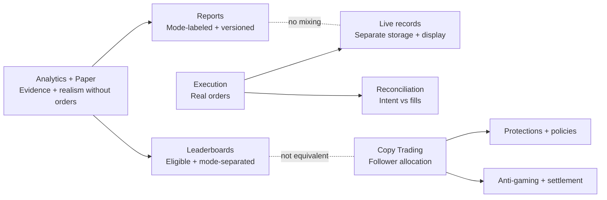

> FUZE starts from the real reason traders lose: unverified edge, unrealistic backtests, and hidden survival risk.
> “Quant” in FUZE means measurable, reproducible, survivable strategies—not magic signals.
> Telegram-native design enables fast workflows, controllable alerts, and always-visible safety controls.
> The platform draws hard boundaries between analytics, execution, and future copy trading to protect trust.
> Mode separation is a core rule: Backtest, Paper, and Live are never blended into one narrative.


___
# 2. What FUZE Quant Platform Is

FUZE Quant Platform is a trader-facing platform that turns “strategy claims” into **verifiable performance evidence**, then makes it easy to run those strategies safely in real time using a **paper-first workflow**. It is designed to feel fast and natural for crypto traders while enforcing strict boundaries that protect trust.

---

## 2.1 One-line definition

FUZE Quant Platform is a Telegram-native quant research and paper simulation platform with standardized trust reporting, designed to help traders evaluate strategies realistically and run them safely—optionally progressing to live execution only when the user chooses.

---

## 2.2 Brain + Proof + Hands

FUZE is organized around a simple model that explains how the platform delivers value without relying on hype.

### Brain

This is the strategy intelligence layer—what the platform “knows” and what it can produce.

* Strategy templates that define how signals are generated
* Strategy versions so changes never rewrite history
* Risk profiles that shape how aggressive or conservative a run behaves
* Clear signal reasoning so users can understand what triggered an action

### Proof

This is the trust layer—what the platform can prove with standardized measurement.

* Backtest reports that show performance under explicit assumptions
* Paper reports that show real-time simulation behavior
* Mode separation so readers never confuse simulation with live results
* Consistent metrics so strategies can be compared fairly
* Regime breakdown so a strategy’s stability is visible, not guessed

### Hands

This is the execution layer—where real trading happens.

* Execution is treated as a separate system boundary
* Live trading requires explicit user action and user-controlled exchange access
* Live outcomes are stored and displayed separately from simulation outcomes
* Reconciliation and audit trails exist to make live activity accountable

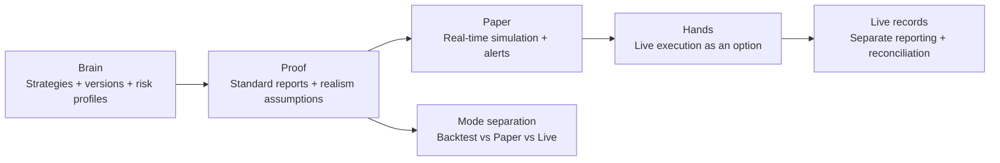

**Why this model matters**

* Traders get a workflow that prevents self-deception.
* Investors get a product architecture that is defensible: trust is enforced by design, not by marketing.

---

## 2.3 What users get today

Today’s product is built around one goal: deliver a complete, usable loop from discovery → verification → paper operation, without requiring users to become developers or infrastructure experts.

### Strategy discovery and library

* A browsable strategy library designed for traders
* Clear summaries so users can quickly shortlist candidates
* Strategy versions so users know exactly what they are evaluating

### Backtests for historical validation

* Backtests to evaluate behavior across historical windows
* A standardized report output so results are interpretable
* Realism assumptions are visible so users understand what “after cost” means

### Paper simulation for real-time proof

* Real-time paper instances that simulate running strategies on live markets
* Alerts for signals and events
* Clear instance status so users know what is running and why it paused

### Reports and metrics built for decision-making

* Consistent performance metrics (not only ROI)
* Drawdown and worst periods shown clearly
* Regime breakdown to show how performance changes in bull/bear/sideways conditions
* Identity metadata so the report is not “just a screenshot”

### Data health protections

* Data health is treated as a first-class product feature
* When the data feed degrades or becomes unreliable, the platform warns and can pause simulation to protect users from false confidence

### Risk controls and kill switch

* Built-in guardrails help prevent runaway behavior
* A kill switch lets users stop instances quickly and safely

### Exports and journaling support

* Exportable artifacts so users can review, journal, and compare over time
* This supports a trader habit loop: verify → run → review → improve

### Credits-based usage model

* A simple platform usage economy using Credits
* Credits can be obtained via Telegram-native flows
* Users pay for compute and usage categories (such as backtests and paper runtime), keeping the model understandable and scalable

---

## 2.4 What users get later

FUZE expands only when the trust foundation is strong. The roadmap is designed to preserve the Brain + Proof + Hands separation and avoid collapsing into a “black box bot product.”

### Expanded data and realism

* Broader market coverage and richer data packs over time
* More robust regime modeling and deeper diagnostics
* Improved realism assumptions where necessary (while keeping them explicit)

### Execution phase

Execution is introduced as a distinct capability, not an implied default.

* User-controlled exchange connectivity
* Strong safety controls, reconciliation, and audit trails
* Live outcomes displayed as Live and never blended with Backtest or Paper history
* A clear promotion path from Paper to Live that requires explicit user intent

### Copy trading

Copy trading is future work and treated as compliance-heavy by design.

* Requires additional policies: allocation logic, follower protections, fairness rules
* Must maintain strict integrity so “paper leaderboard wins” don’t automatically become “copy-trading-ready”
* Introduced only when the system can uphold trust and user protection at scale

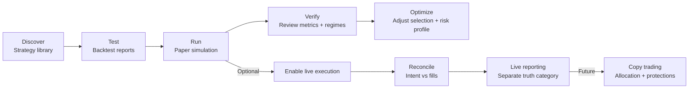

**What stays constant as FUZE evolves**

* Proof is always required before scale.
* Mode separation remains non-negotiable.
* Trust standards apply to every strategy, every report, every leaderboard entry.

> FUZE is not a “signal group” or a hype bot—it is a system built to turn claims into proof.
> Brain creates strategies, Proof makes performance verifiable, and Hands executes only when users choose.
> The platform ships paper-first so traders can build confidence with realism and safety.
> Execution and copy trading are expansions that must preserve trust boundaries, not bypass them.
> If the product ever feels like “just screenshots,” it is failing its core design rule: verify, don’t believe.

___

# 3. Who It’s For

FUZE Quant Platform is designed for people who trade crypto actively enough to care about speed and reliability—but who also want proof, discipline, and realistic evaluation instead of hype. The platform is intentionally built for **non-developers**: everything important is expressed through modes, reports, controls, and a Telegram-native workflow.

---

## 3.1 Active traders

Active traders care about **timing**, **attention**, and **execution conditions**. They are often overwhelmed by noise and “signal overload,” yet still want fast reactions when a setup is valid.

### What they need

* Fast signals on shorter timeframes (such as 5m)
* Alerts that are actionable, not spam
* Clear instance status: what’s running, why it paused, what changed
* Quick safety controls (including a kill switch)
* Proof that strategies are not cherry-picked screenshots

### How FUZE fits

* Traders can run a paper instance that follows live market movement without placing real orders
* Alerts can be delivered in Telegram-native flow, with safety around noise (digest, quiet hours, anti-spam patterns)
* Performance is presented with survival metrics and regime breakdowns so an “active edge” is not confused with a lucky streak

### What this protects them from

* Overtrading due to noisy alerts
* Blind trust in unverified strategies
* “Looks good yesterday” strategies that fail when volatility changes

---

## 3.2 Swing traders

Swing traders prioritize **structure** over speed. They want fewer decisions, clearer context, and a reliable baseline timeframe (such as 1h) that reduces noise.

### What they need

* Strategies that behave predictably across regimes
* Transparent drawdowns and worst periods
* Reports that make risk understandable (not just ROI)
* A way to compare strategies fairly and consistently

### How FUZE fits

* Backtest reports help validate behavior historically under explicit assumptions
* Paper mode lets swing traders observe real-time behavior without committing capital
* The platform emphasizes “paper-first” so traders build confidence through evidence

### What this protects them from

* Selecting strategies based on ROI without understanding drawdown
* Misreading backtests that ignore realism assumptions
* Confusing simulation outcomes with live outcomes

---

## 3.3 Semi-pro and community traders

This group includes traders who take performance seriously and want a repeatable process, even if they are not running a professional desk. They often share strategies, compare notes, and build community around results.

### What they need

* Exportable reporting artifacts for journaling and review
* A way to track strategy behavior over time without changing “the story”
* A standardized language for comparing results
* A path from learning to disciplined operation

### How FUZE fits

* Strategy versioning prevents “moving target” strategies from rewriting history
* Reports include identity metadata so the same strategy can be compared over time
* Exports support journaling, review, and community discussion without relying on vague screenshots

### What this protects them from

* Community hype loops where claims cannot be verified
* Strategy drift (logic changes) that makes old results meaningless
* Ranking systems that reward only ROI and ignore survivability

---

## 3.4 Investor lens: why this segment is valuable

From an investor perspective, FUZE targets a segment with strong product-market fit characteristics:

### High-frequency decision-making creates habit

Active and semi-pro traders check markets often. If the platform provides reliable proof and usable alerts, it becomes part of their routine.

### Trust is the wedge, not entertainment

Most trading products grow by excitement. FUZE grows by credibility:

* Mode separation prevents misleading narratives
* Standard reports turn strategy evaluation into a repeatable process
* Data health and safety controls reduce “platform blame” events during volatility

This builds long-term retention because users stay when they trust the measurement.

### Clear monetization alignment

A usage-based credit model aligns spending with value:

* Users spend when they run backtests, operate paper simulations, or use higher quotas
* The platform scales as usage scales, without forcing users into large upfront commitments

### Network effects without sacrificing integrity

Community features (sharing, leaderboards, referrals) can accelerate distribution, but FUZE’s differentiation is that social proof is tied to **report-linked evidence**, not unverified claims.

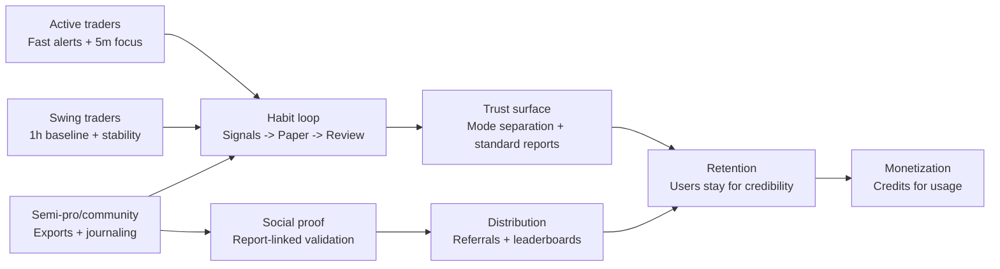

### What this segment is not

FUZE is not built for:

* People seeking guaranteed profits
* People who want “one-click magic signals” with no proof
* People who want execution without understanding risk

FUZE is built for users who want a disciplined path: **verify → simulate → operate → (optional) execute**, with safety controls and clear truth categories.

---

> FUZE is built for traders who want speed and clarity without sacrificing proof.
> Active traders get fast workflows and controlled alerts, swing traders get stability and interpretability.
> Semi-pro and community traders get versioned strategies, exports, and a shared language for verification.
> For investors, trust-first design creates retention, and usage-based credits create scalable monetization.
> The segment is valuable because habit + proof + integrity can compound into durable distribution.

___

# 4. Product Overview

FUZE Quant Platform is designed as a simple user journey: **pick a strategy → verify it → run it in paper → review results → optionally move toward live execution later**. Everything in the product is organized to keep traders fast, safe, and mode-aware.

---

## 4.1 Supported markets and venues

FUZE starts with a focused MVP scope so results are consistent and comparable.

### Markets

* BTC and ETH pairs as the initial primary focus

### Venues

* Binance and KuCoin as initial supported exchanges

### Instruments

* Spot
* Perpetual futures

### Timeframes

* 5m for active trading behavior and fast alerts
* 1h as a stability-oriented baseline

**Why this scoped approach matters**

* Traders can compare strategies apples-to-apples
* Reports remain interpretable because the assumptions and data characteristics are consistent
* The platform can enforce trust rules and safety controls without fragmentation

---

## 4.2 Modes explained

Modes are the most important concept in FUZE. A mode is a **truth boundary**: it defines what is real, what is simulated, and what a report means. FUZE does not allow results to blur across modes.

### Backtest

**What it is**

* A historical simulation that runs the strategy over past market data.

**What it is good for**

* Understanding strategy behavior across different market periods
* Comparing strategies using standardized metrics
* Seeing how a strategy handled drawdowns and worst periods historically

**What it is not**

* A guarantee of future performance
* A substitute for real-time observation

**What you will see**

* A report labeled Backtest with:

  * Strategy version identity
  * Date range
  * Assumptions used (cost model, etc.)
  * Standard metrics and regime breakdown

---

### Paper

**What it is**

* A live simulation that listens to real-time market movement and produces signals, simulated fills, and simulated P&L.

**What it is good for**

* Validating that a strategy behaves as expected under current market conditions
* Observing alert quality and operational performance without risking funds
* Building trader habit and trust before any live execution

**What it is not**

* Real orders
* A guarantee that live fills will match simulated fills

**What you will see**

* A running instance with:

  * Status (running/paused)
  * Reason codes for pauses
  * Alerts and events
  * A Paper performance report labeled Paper

---

### Live

**What it is**

* Real order execution on a connected exchange account.

**What it is good for**

* Traders who intentionally choose to place real orders using the FUZE workflow

**What it is not**

* Required to benefit from FUZE’s strategy proof and paper workflow
* Allowed to merge with simulation evidence

**What you will see**

* Live records and reports labeled Live
* Reconciliation details to make execution accountable

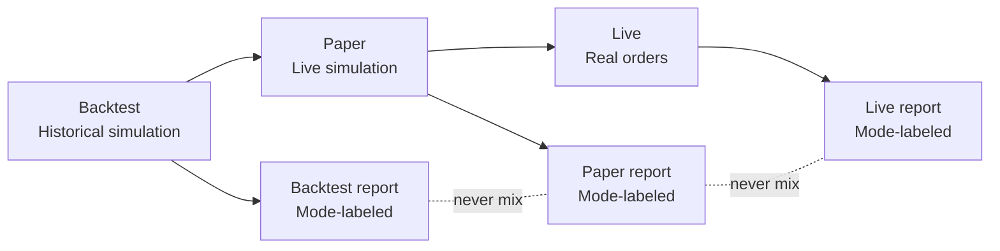

---

## 4.3 Key features

This is the user-facing feature set that forms the daily workflow.

### Strategy library

* Browse strategies with clear summaries
* Compare strategies using standardized evidence
* Select a strategy version deliberately (so results stay interpretable)

### Backtests

* Run historical validation in a consistent format
* See standardized metrics (not only ROI)
* Compare across regimes (bull/bear/sideways)

### Paper trading simulation

* Run real-time simulated instances
* Receive alerts for signals and events
* Observe behavior and stability under current market conditions

### Reports and metrics

* Standardized reporting output across strategies
* Clear identity metadata so reports remain meaningful
* Survival-oriented metrics (drawdowns, worst periods, exposure)

### Alerts

* Telegram-native delivery
* Controls to prevent spam and attention fatigue
* Digest and quiet hours patterns to respect real trading life

### Exports

* Export artifacts for journaling, review, and community discussion
* Supports discipline: review results rather than chasing emotions

### Data health

* The platform monitors market data quality
* Warnings and protections activate if data becomes unreliable
* Prevents false confidence caused by degraded inputs

### Risk controls and kill switch

* Built-in guardrails reduce runaway behavior
* A kill switch allows immediate stopping when the trader wants full control

---

## 4.4 Feature gating

FUZE uses two gating dimensions so users always understand what they can do and why:

1. **By mode** (Backtest vs Paper vs Live)
2. **By user level** (tiers that increase quota, access, and discounts)

### Gating by mode

**Backtest**

* Strategy evaluation and reporting
* Historical comparison
* Export of backtest evidence

**Paper**

* Real-time simulation instances
* Alerts and monitoring
* Paper reporting and exports
* Safety auto-pauses based on risk and data health

**Live**

* Real execution controls
* Live-specific safety rules and reconciliation
* Live reporting stored and displayed separately

### Gating by user level

User levels are designed to make the platform accessible to new users while scaling for power users.

* Lower tiers can run the core proof loop
* Higher tiers increase quotas and unlock more frequent usage
* Discounts can be represented as bonus credits, keeping pricing easy to understand

**Why this matters**

* Traders don’t feel forced into expensive plans just to test the platform
* Power users can scale usage without breaking the integrity of trust reporting
* The platform stays sustainable and fair under high usage

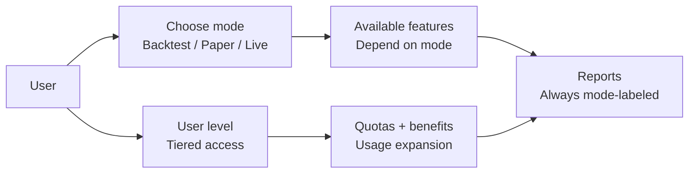

> FUZE is built around a simple workflow: discover a strategy, verify it, run it in paper, then decide what to do next.
> Modes are truth boundaries—Backtest, Paper, and Live are always separated and never blended.
> The MVP scope focuses on BTC/ETH, Binance/KuCoin, spot and perps, with 5m and 1h timeframes for clarity and comparability.
> Key features support proof and daily operation: strategy library, backtests, paper simulation, reports, alerts, exports, data health, and safety controls.
> Feature access is gated by mode and user level so the platform remains fair, scalable, and easy to understand.

___

# 5. Telegram Mini App UX

FUZE Quant Platform is built as a Telegram Mini App because trading is a behavior loop, not a one-time setup. The UX is designed for fast decision-making, low attention overhead, and always-visible safety and trust context.

The guiding idea is simple: **make the correct workflow effortless**—paper-first, mode-aware, and controllable at any moment.

---

## 5.1 UX principles

### Fast, not complicated

Traders should be able to:

* understand what’s happening in seconds
* start paper simulation without setup friction
* stop or pause instantly when needed

### Trust-first everywhere

The UX continuously reinforces truth boundaries:

* every result is clearly labeled by mode (Backtest, Paper, Live)
* reports always include identity details (strategy version, timeframe, assumptions)
* leaderboards and social proof are report-linked, not “screenshot-based”

### Paper-first by default

The first meaningful “run” experience is paper simulation:

* no exchange connection required to begin
* users can learn alert behavior and strategy behavior safely
* the platform encourages proof before commitment

### Safety must be one tap away

Risk control is not a hidden settings page. Traders should always have:

* a clear kill switch
* visible pause reasons
* visible risk and data health warnings

### Attention is a scarce resource

Alerts and notifications must be usable:

* instant alerts for critical events
* digest mode for routine signals
* quiet hours to prevent fatigue
* anti-spam rules to reduce noise loops

---

## 5.2 Navigation map

FUZE uses a simple navigation structure that matches how traders think:

* **Home**: “What’s happening right now?”
* **Strategies**: “What can I run?”
* **Lab**: “What proof exists?”
* **Run**: “What am I running and how do I control it?”
* **Wallet**: “How do credits, levels, and spend work?”

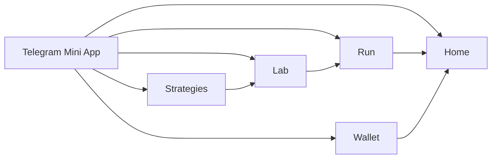

---

## 5.3 Onboarding

Onboarding is designed to get users to the “first proof moment” quickly, without requiring exchange keys.

### Step 1: Mode education (short, practical)

The user is shown:

* Backtest = historical simulation
* Paper = live simulation
* Live = real orders (optional, separate)

The UX should never assume the user already understands these differences.

### Step 2: Paper-first start

The first recommended action is:

* pick a strategy from the library
* start a paper instance immediately

This gives the user a real experience of:

* signals and alerts
* instance status
* pause reasons
* reporting format

### Step 3: Trust orientation

Before a user becomes emotionally attached to ROI, the UX teaches:

* why drawdown and worst periods matter
* why regimes matter
* why “no-mixing” exists

### Step 4: Optional expansions

Only after the user understands paper:

* encourage deeper backtest exploration
* explain credits and quotas
* later: introduce live execution as a deliberate choice, not a default

**What onboarding avoids**

* forcing exchange connection to “get value”
* presenting paper results as live results
* burying risk controls in complicated menus

---

## 5.4 Core screens

Each screen is designed to answer a single core question.

### Home: status, instances, risk flags, data health, credits

**Primary question:** “What’s going on right now?”

What Home shows at a glance:

* Running instances (Paper and Live listed separately)
* Mode badges (Backtest results never mixed into “live status”)
* Data health indicator (healthy / degraded / unhealthy)
* Risk flag indicators (if an instance is near limits)
* Credits balance and quick link to wallet/ledger
* Recent alerts and important events

Home is where users decide whether to:

* open Run to manage an instance
* open Lab to review results
* open Strategies to start something new

---

### Strategies: browse and compare trust snapshots

**Primary question:** “What can I run, and what evidence exists?”

What Strategies emphasizes:

* strategies presented as versions, not vague names
* quick comparisons using standardized metrics
* visible regime behavior (at least in summary form)
* clear “Start Paper” action from the strategy page

A good Strategies experience prevents:

* selection based on hype text
* selection based only on ROI
* confusion about what changed between versions

---

### Lab: backtests and reports

**Primary question:** “What proof exists, and how should I interpret it?”

Lab is the evidence center:

* backtest reports
* paper reports (if applicable)
* consistent metrics presentation
* report identity details visible by default

Lab teaches discipline by design:

* ROI is always accompanied by survival metrics
* regime breakdown is easy to find
* the report identity makes it hard to misread or mis-share results

---

### Run: manage paper/live instances and controls

**Primary question:** “What am I running, and do I need to intervene?”

Run is the operations screen:

* list of active and paused instances
* clear pause reasons (risk limit hit, data health issue, etc.)
* controls: pause, resume, stop
* kill switch access

Key UX expectations:

* controls are explicit and reversible where safe
* the user always knows whether the instance is Paper or Live
* any action that could affect real trading is clearly marked and never triggered accidentally

---

### Wallet: Stars to Credits, level, ledger

**Primary question:** “How does usage work, and what am I spending?”

Wallet explains and visualizes:

* credits balance
* conversion logic (Stars → Credits)
* user level and benefits
* a ledger of credit events (mint, spend, refund, reversal)

The Wallet UX should make it obvious:

* what consumes credits
* why a user hit a fair-use limit
* what they gain by leveling up

---

## 5.5 Alerts UX

Alerts are where most trading products fail: either they spam users into burnout, or they become too weak to matter. FUZE treats alerts as a controlled system.

### Alert types

* **Signal alerts**: “a strategy condition triggered”
* **Risk alerts**: “limits are approaching or breached”
* **Data health alerts**: “inputs may be unreliable”
* **Instance lifecycle alerts**: “started, paused, resumed, stopped”
* **Execution alerts (Live only)**: “order events and reconciliation signals”

### Attention controls

* **Instant vs digest**

  * Instant: critical events, risk, data health, live execution events
  * Digest: routine signals, periodic summaries
* **Quiet hours**

  * Prevent fatigue and allow users to define off-time
* **Anti-spam controls**

  * Cooldowns and bundling to reduce repeated alerts during choppy markets

### Mode labeling in alerts

Every alert is mode-labeled:

* Paper alerts are never phrased as “you bought/sold” in the same way as Live
* Live alerts are explicitly marked as real execution events

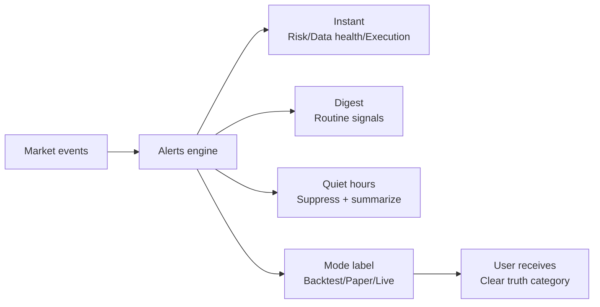

> FUZE’s Telegram Mini App UX is built for real trading behavior: fast decisions, low friction, and constant clarity.
> The navigation is simple—Home, Strategies, Lab, Run, Wallet—each answering one core trader question.
> Onboarding is paper-first so users can gain value and build trust without connecting an exchange.
> Safety is always visible: mode badges, pause reasons, data health warnings, and one-tap controls.
> Alerts are treated as a controlled system—mode-labeled, anti-spam, digest-ready, and respectful of attention.

___

# 6. Trust & Performance Reporting

FUZE Quant Platform is built around a simple idea: **a strategy is only as valuable as the evidence you can verify**. “Trust” in FUZE does not mean believing a creator, influencer, or screenshot. It means a report is structured so any reader can understand **what ran, under what assumptions, in what mode, across which market conditions**, and compare it fairly to other strategies.

---

## 6.1 What trust means

In FUZE, a trustworthy report answers these questions clearly and consistently:

* **What is this result?** (Backtest, Paper, or Live)
* **What exactly ran?** (strategy version and configuration)
* **Where did it run?** (market, instrument, venue scope)
* **When did it run?** (time range and timeframe set)
* **What assumptions were applied?** (fees, slippage, spread, and other cost logic)
* **How did it survive?** (drawdown, worst week/day, exposure)
* **How did it behave across regimes?** (bull, bear, sideways breakdown)
* **Can the result be reproduced from the same inputs?** (same strategy version + same window + same cost model)

FUZE treats reporting as a product standard, not a “nice-to-have.” This is how the platform prevents “pretty but fake” results and makes strategies comparable across time, markets, and modes.

---

## 6.2 Standard metrics

FUZE reports always show a minimum set of metrics designed to prevent ROI-only decision-making. These metrics are presented as a consistent block across strategies so users can compare quickly.

### Return metrics

* **After-fee ROI**
  The total return after applying the platform’s cost assumptions (fees, slippage, spread). This is the headline number—but it is never shown alone.

### Survival metrics

* **Max drawdown**
  The largest peak-to-trough equity decline in the report window. This is the best single number for “how painful the worst period was.”

* **Worst day / Worst week**
  The worst single-day and single-week performance in the report window. These reveal tail risk that ROI often hides.
  *Important:* these are computed deterministically using fixed day/week boundaries so results remain reproducible.

### Exposure and realism metrics

* **Exposure**
  A measure of “how often / how much you are at risk.” A strategy can look great with low exposure (selective entries), or it can look great but be risky because it is almost always exposed.

* **Turnover**
  A measure of “how much you trade.” High turnover strategies are more sensitive to trading frictions (fees, spread, slippage). Turnover is a reality-check for strategies that look strong before costs.

### Trade outcome metrics

* **Win rate**
  The fraction of closed trades that are profitable after costs. Win rate is useful, but it can be misleading without drawdown context.

* **Trade count**
  The number of closed trades. This helps readers understand whether results are based on meaningful sample size or a small number of outcomes.

### Curves and evidence views

A FUZE report is not only a metric list. It includes core evidence surfaces:

* **Equity curve** (how the account balance changes over time)
* **Drawdown curve** (how deep the declines were and when they occurred)
* **Trades list** (filterable) so users can inspect behavior and frequency

### Optional metrics

Some advanced metrics may be shown (example: Sharpe), but they are always treated as secondary. FUZE never allows optional metrics to replace survival metrics as the main trust indicators.

---

## 6.3 Regime breakdown

Crypto is not one market. It is a sequence of regimes. A strategy that performs well in a trending bull can collapse in sideways chop or during sharp bear moves. That is why FUZE requires a regime breakdown in every report.

### What a regime is

A **regime** is a deterministic label applied to each time segment of the report window:

* **Bull**
* **Bear**
* **Sideways**

The classifier is:

* **deterministic** (no subjective labeling)
* **versioned** (so changes never rewrite history)
* **anchored to a stable timeframe** for consistency (MVP uses candle-based logic)

### What the regime table shows

Every report includes a regime table with at least:

* After-fee ROI
* Max drawdown
* Trade count
* Exposure
* Turnover
* Time share (how much of the window was bull/bear/sideways)

This makes it obvious whether a strategy is:

* robust across regimes, or
* dependent on one favorable condition

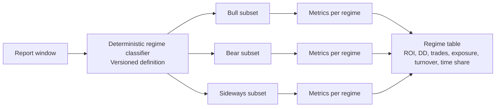

---

## 6.4 No-mixing rule

The most common way trading products mislead users is by mixing different truth categories into one performance story. FUZE forbids this by design.

### What “mixing” looks like in the real world

* Showing a backtest ROI next to paper results and implying both are “track record”
* “Continuing” a strategy’s record after changing logic without creating a new version
* Switching cost assumptions and still presenting results as comparable
* Combining multiple markets or timeframes without labeling how aggregation was done

### Why mixing is dangerous

Mixing creates false confidence because it hides the real question:
**“Did this result come from historical simulation, live simulation, or real execution?”**

Backtest, Paper, and Live have different failure modes. When they are blended, the user cannot evaluate risk correctly.

### How FUZE enforces no-mixing

FUZE prevents mixed narratives at every layer users touch:

* **Mode-separated performance tabs**: Backtest Reports, Paper Track Record, Live Track Record
* **Identity block on every report**: a “report passport” that makes mixing obvious and disallowed
* **Leaderboards and trust snapshots** are always mode-labeled
* **Exports** keep the same identity so shared reports remain interpretable outside the app

### What can be aggregated (only if explicit)

If a report covers multiple markets, aggregation is allowed only when the platform explicitly labels:

* the aggregation type (single market vs multi-market)
* the weighting rule used

No “silent blending” is permitted.

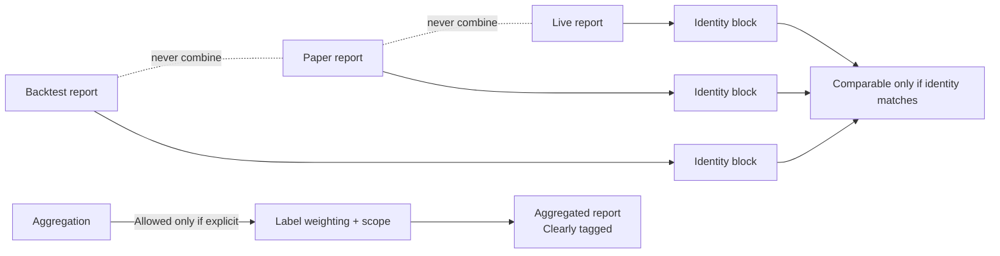

---

## 6.5 Realism assumptions

A report is only trustworthy if it is clear about costs. In crypto—especially for active trading—costs can be the difference between profit and loss.

### What the cost model includes

In simulation modes (Backtest and Paper), FUZE applies an explicit cost model that can include:

* trading fees
* slippage assumptions
* spread assumptions

For perpetual futures, additional realities (such as funding) are treated as part of the platform’s realism roadmap and must be handled explicitly when introduced.

### Why this matters for users

* A strategy with **high turnover** can collapse when costs are realistic
* A strategy with **low turnover** may be more resilient and predictable
* A strategy’s cost model must be visible so users understand what “after-fee ROI” really means

### What FUZE guarantees here

* Costs are not hidden
* Cost assumptions are included in report identity
* Changing cost assumptions changes the truth category of the report, so it cannot be silently compared to a different assumption set

---

## 6.6 Report identity

Every FUZE report includes an identity block—think of it like a passport that makes the result interpretable and comparable.

### What the identity block includes

A report identity includes, in user-readable terms:

* **Mode**: Backtest, Paper, or Live
* **Strategy version**: the exact version that produced the result
* **Markets and venues**: what was traded and where
* **Timeframes**: what time resolution was used (for example, 5m and/or 1h)
* **Time range**: the window the report covers
* **Initial capital**: the starting amount and currency used for accounting
* **Instrument scope**: spot vs perp (kept distinct)
* **Cost model**: which cost assumptions were applied
* **Data snapshot**: the exact dataset window used (at minimum, a checksum identity)
* **Regime definition**: which regime classifier version was applied
* **Engine version**: the simulation/reporting engine version (so changes are visible)

### How to use identity as a reader

Two reports are meaningfully comparable only when their identity is aligned. If any of these change—mode, strategy version, cost model, market set, timeframe set, or time window—you are not looking at the same truth category.

### Example: report identity block

| Field             | Example meaning                       |
| ----------------- | ------------------------------------- |
| Mode              | Paper                                 |
| Strategy version  | Version X (immutable snapshot)        |
| Markets           | BTC/USDT, ETH/USDT                    |
| Venue scope       | Binance, KuCoin                       |
| Instrument scope  | Perp                                  |
| Timeframes        | 5m, 1h                                |
| Window            | From A to B                           |
| Initial capital   | Fixed starting equity in USDT         |
| Cost model        | Fees/slippage/spread assumptions used |
| Regime definition | Regime classifier version             |
| Data snapshot     | Dataset identity/checksum             |
| Engine version    | Reporting engine version              |

---

## 6.7 Interpretation guide

This section is the practical “how to read FUZE reports” guide—so users don’t need guesswork.

### Step 1: Start with mode

* **Backtest** answers: “How did this strategy behave historically under explicit assumptions?”
* **Paper** answers: “How is this behaving in today’s market conditions, with live updates, without risking funds?”
* **Live** answers: “What happened with real orders on an exchange?”

Never treat Backtest as Live. Never treat Paper as Live.

### Step 2: Read survival before ROI

Before caring about ROI, check:

* Max drawdown
* Worst week and worst day

If these are severe, the strategy may be psychologically or financially unsustainable—even if ROI looks impressive.

### Step 3: Check exposure and turnover

* **High exposure** means you are “in the market” more often. This can increase risk during shocks.
* **High turnover** means costs matter more. If turnover is high, a small change in fees/slippage assumptions can flip results.

A useful mental model:

* High ROI + high turnover + deep drawdown = “fragile until proven otherwise”
* Moderate ROI + controlled drawdown + reasonable turnover = “often more survivable”

### Step 4: Use the regime table to detect dependency

Look for patterns like:

* Strong bull performance but weak bear/sideways performance
  → strategy may be regime-dependent
* Balanced performance across regimes
  → strategy is more robust
* Sideways breakdown is especially important for active trading
  → many strategies fail in chop

### Step 5: Inspect the curves

* Equity curve: does growth come smoothly, or via one lucky spike?
* Drawdown curve: are there long recovery periods?
* Worst week/day: do the worst events cluster around volatility spikes?

### Step 6: Validate trade count and win rate in context

* High win rate can hide a “small wins, occasional huge losses” profile.
* Low win rate can still be profitable if winners are much larger than losers.
  Always interpret win rate with drawdown and worst week/day.

### Step 7: Respect data health warnings

FUZE includes a data health summary for the report window. If data was degraded or missing:

* treat conclusions as lower confidence
* prefer a cleaner window or rely more on Paper observation once data health is stable

### Common “what if” scenarios

* **What if a strategy looks great in Backtest but weak in Paper?**
  Market regime may have changed, or the strategy may be overfit. Paper exists to reveal this gap before money is at risk.

* **What if Paper pauses unexpectedly?**
  That is a protection feature. Pauses occur when risk limits or data health safeguards trigger. Use the pause reason to decide whether to resume, adjust, or stop.

* **What if ROI is high but worst week is brutal?**
  The strategy may be untradable for most users. FUZE surfaces worst week/day specifically to prevent this trap.

* **What if performance is strong only in bull regimes?**
  Treat it as a conditional tool, not a universal strategy. Consider whether you will actually stop using it when the regime changes.

---

> Trust in FUZE means reports are reproducible, mode-labeled, cost-explicit, and comparable.
> The platform forces survival metrics and regime breakdowns so ROI can’t hide fragility.
> No-mixing is non-negotiable: Backtest, Paper, and Live are separate truth categories.
> Report identity makes results interpretable and prevents silent blending across versions, costs, or scopes.
> If you read one thing first: check mode, then drawdown and worst week/day, then regimes—only then look at ROI.


___

# 7. How It Works

FUZE Quant Platform is designed so a non-developer can run a professional-grade workflow without guessing. The system is built around three simple objects—**strategies**, **versions**, and **instances**—and one default path: **paper-first**.

This section explains the user-facing logic: what you create, what you run, what you see, and why the platform behaves the way it does.

---

## 7.1 Strategy templates and versions

### Strategy template

A **strategy template** is the reusable definition of a trading idea—its rules, signal logic, and configurable parameters. It answers:

* What conditions trigger entries and exits?
* What market/timeframe does it apply to?
* What constraints and risk behaviors does it assume?

A template is meant to be understood, tested, and compared—not treated as a mysterious black box.

### Strategy version

A **strategy version** is an immutable snapshot of a strategy template at a point in time. It exists for one reason:

**to prevent history from being rewritten.**

If the logic changes, a new version is created. That means:

* old results remain valid for the old version
* new results belong to the new version
* comparisons stay honest

### Why versioning matters for traders

Without versioning, it’s easy to fall into this trap:

* a strategy performs well
* the logic is changed after the fact
* old results are still shown as if they belong to the new logic

FUZE prevents this. When you read a report, you’re not reading “a strategy name.” You’re reading **a strategy version**.

### Why versioning matters for investors

Versioning is an integrity feature:

* it reduces “marketing drift” over time
* it makes leaderboards and social proof defensible
* it supports long-term trust as the strategy library grows

---

## 7.2 Strategy instance lifecycle

A **strategy instance** is your personal run of a specific strategy version in a specific mode.

It has a lifecycle that is meant to be predictable, observable, and controllable.

### Create

You create an instance by selecting:

* a strategy version
* a mode: Backtest, Paper, or Live
* a risk profile (conservative/medium/aggressive)

### Run

When the instance starts, it:

* evaluates market conditions continuously (Paper/Live) or across a historical window (Backtest)
* produces signals and events
* generates reporting artifacts that match the mode

### Pause

Instances can pause for reasons that protect the user:

* risk control limits were reached
* data health became unreliable
* the user paused manually
* usage limits were reached (for example, quotas tied to credits/levels)

A paused state is not a failure. It is a safety behavior. The platform should show a **clear pause reason** so users know what happened.

### Stop

Stop ends the instance lifecycle for that run. Reports remain available as the record of what occurred.

### What you should always see

For any instance, FUZE makes these visible:

* mode badge (Backtest/Paper/Live)
* status (running/paused/stopped)
* pause reasons (if paused)
* report access (the evidence output)

---

## 7.3 Paper-first workflow

FUZE’s default recommendation is paper-first because it reduces the chance of confusing simulation with reality, and it helps users validate strategy behavior under current market conditions without risking funds.

### The recommended path

1. **Discover** a strategy in the library
2. **Backtest** to understand historical behavior
3. **Run Paper** to observe real-time behavior safely
4. **Review** standardized reports and regime behavior
5. **Decide** whether to keep running, switch strategies, or later consider Live

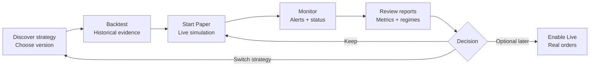

### Why this matters

Paper-first is a built-in protection against the most common trading mistakes:

* believing a backtest is “the truth”
* skipping realism and operational observation
* going Live based on excitement rather than evidence

Paper is where traders build the habit of reading results correctly.

---

## 7.4 Risk profiles

Risk profiles exist so the same strategy logic can be expressed in different “behavior styles” without pretending one setting fits everyone.

### Conservative

Designed for survivability and smoother behavior.

* prioritizes loss control and stability
* tends to reduce exposure during uncertainty
* suitable for users who value drawdown control over excitement

### Medium

Balanced profile for typical use.

* aims for reasonable participation and reasonable protection
* designed to be a default starting point for many users

### Aggressive

Designed for higher participation and potentially higher volatility of outcomes.

* accepts larger swings
* can increase exposure and frequency
* appropriate only for users who fully understand drawdowns and worst-week risk

### What risk profiles are not

* They are not “profit settings.”
* They do not guarantee outcomes.
* They are not a substitute for understanding the report and regime behavior.

### Why risk profiles matter for investors

Risk profiles reduce churn by aligning outcomes with user expectations:

* a user who wants conservative behavior won’t be forced into aggressive swings
* the platform can serve multiple trader personas without redesigning strategies
* consistent profiles support clearer performance communication and fewer misunderstandings

---

## 7.5 Data health protections

FUZE treats data health as a first-class product feature because a strategy is only as reliable as the data feeding it.

### Health states

FUZE classifies data quality into clear states:

* **Healthy**: data is timely and consistent
* **Degraded**: data may be delayed or partially missing
* **Unhealthy**: data is unreliable enough that simulation should not be trusted

### What happens when health degrades

When data health is not healthy, FUZE shifts from “operate” to “protect”:

* show a visible warning
* explain impact in simple terms
* pause Paper simulation when the integrity of results would be compromised

### Why this matters to traders

Without data health protections, traders can get false confidence:

* strategies may “look stable” because signals are missing
* reported outcomes may drift away from what would have occurred with proper inputs
* alerts may arrive late and become harmful instead of helpful

### Common scenarios the system is designed to handle

* sudden exchange outages or partial market data gaps
* delayed candle updates during volatility spikes
* inconsistent pricing behavior that would distort simulation integrity

The goal is not perfection. The goal is to make the system honest about when it can and cannot be trusted.

---

## 7.6 Auditability

Auditability means the platform keeps a reliable record of what happened so users and the platform can resolve misunderstandings and protect integrity.

### What auditability covers in user terms

FUZE maintains a structured record of:

* which strategy version was used
* which mode the instance ran in
* when the instance started, paused, resumed, and stopped
* what the pause reasons were
* what reports were generated and what identity they carry
* key user actions that affect outcomes (such as changing risk profile or stopping an instance)
* usage events that affect billing fairness (such as credit spends and reversals)

### Why traders benefit

* You can explain your results without relying on memory.
* You can compare runs honestly over time.
* If something looks wrong, you can pinpoint whether it was strategy behavior, risk limits, or data health.

### Why investors benefit

Auditability is a trust moat:

* it supports integrity across leaderboards and social proof
* it reduces disputes and misinformation
* it prepares the product for higher-trust features later (like execution and copy trading)

> FUZE works through three objects: strategy templates, immutable versions, and user-run instances.
> Paper-first is the default path because it creates proof without risking funds and prevents mode confusion.
> Risk profiles let users match strategy behavior to their tolerance instead of chasing ROI blindly.
> Data health protections ensure simulations don’t pretend to be reliable when inputs degrade.
> Auditability makes results explainable, comparable, and defensible as the platform scales.

___

# 8. Safety, Risk Controls, and User Protection

FUZE Quant Platform is built for real trading behavior, which means it must be built for real trading risk. Safety is not a checkbox; it is a system of guardrails that protects users from the most common failure modes: overexposure, runaway losses, volatility shocks, noisy alerts, and confusing simulations with reality.

Safety in FUZE has two goals:

1. **Prevent avoidable harm** (runaway behavior, false confidence, spam-driven overtrading)
2. **Make risk visible and controllable** (so the user stays responsible and informed)

---

## 8.1 Built-in guardrails

Guardrails are limits and rules that keep strategy instances from drifting into catastrophic outcomes without warning.

### Drawdown limits

A drawdown limit is a protective ceiling on how far an instance is allowed to decline from its peak value before action is taken.

**Why it exists**

* Traders often fail not because the strategy never works, but because a single deep drawdown forces them to stop at the worst time.
* A drawdown limit creates a disciplined stop condition when emotions would otherwise take over.

**What happens when triggered**

* The instance is paused or stopped (depending on policy)
* The user receives a clear notification with the reason
* The report remains available so the user can review and learn

### Daily loss limits

A daily loss limit prevents a strategy instance from compounding losses during bad days.

**Why it exists**

* “Bad days” happen most often during volatility spikes, news-driven moves, or regime transitions.
* Without a daily limit, an active strategy can churn itself into deeper losses quickly.

**What happens when triggered**

* The instance pauses to force a review moment
* Users can decide whether to resume later, change risk profile, or stop entirely

### Exposure limits

Exposure limits reduce the chance of “always-in-market” behavior that can be disastrous during shocks.

**Why it exists**

* High exposure can look profitable during trends but becomes dangerous during sudden reversals.
* Limiting exposure helps strategies survive regime changes.

**What happens when triggered**

* The system reduces activity or pauses the instance
* The reason is shown explicitly so users understand it was a risk rule, not a bug

### Practical note

Guardrails are not designed to “guarantee profitability.” They are designed to prevent common loss spirals and enforce review points.

---

## 8.2 Kill switch

The kill switch is the user’s emergency brake.

### What it does

* Immediately stops or pauses a running instance
* Prevents further activity from that instance until the user deliberately resumes or restarts

### When users should use it

* When volatility becomes extreme and you want to pause decision-making
* When you suspect something is wrong (data health warnings, unusual behavior)
* When you simply want to regain full manual control

### Why it matters

Traders need a sense of control. If users cannot stop instantly, they either:

* never trust the system, or
* panic and make worse decisions.

The kill switch exists to keep the user in charge.

---

## 8.3 Perp-specific cautions

Perpetual futures introduce risks that do not exist in spot trading. FUZE makes these risks explicit rather than hiding them behind ROI.

### Leverage amplifies everything

* Gains and losses scale faster
* Drawdowns become more psychologically and financially dangerous
* Risk limits become more important, not less

### Liquidation is a structural risk

Perps can liquidate positions if margin requirements are breached. This is not “a bad trade.” It is a structural failure outcome.

What users must understand:

* liquidation risk increases during volatility spikes
* liquidation risk increases when exposure is high
* liquidation risk increases when the market gaps or moves sharply

### Volatility and funding realities

Perp markets can behave differently from spot:

* spreads can widen sharply
* slippage can increase
* funding mechanics can influence net results over time

FUZE treats perp operation as a higher-risk category and designs safety messaging accordingly.

---

## 8.4 Alerts safety

Alerts are powerful and dangerous at the same time. They can help traders act quickly—or they can push traders into compulsive overtrading.

FUZE designs alerts as a controlled system, not an unfiltered firehose.

### Spam control and cooldowns

* Repeated signals during sideways chop can create alert storms
* FUZE uses cooldown and bundling patterns so alerts remain meaningful

### Digest mode

Not every signal deserves immediate attention.

* Digest mode consolidates routine signals into periodic summaries
* This helps traders avoid attention fatigue and emotional trading loops

### Quiet hours

Traders are human.

* Quiet hours reduce burnout and prevent sleep disruption
* Critical alerts can still be handled with policy-based exceptions if needed

### Safety-first alert types

FUZE treats certain alerts as higher priority:

* risk limit approach / breach
* data health degraded / unhealthy
* instance paused for protection reasons
* live execution events (if live execution is enabled)

### Mode labeling in alerts

A critical safety rule:

* Paper alerts must never feel like “real trades happened”
* Live alerts must clearly indicate real execution

This prevents the most common misunderstanding: confusing simulation with reality.

---

## 8.5 What FUZE does NOT do

This section is intentionally direct. Clear boundaries protect users and protect trust.

FUZE does not:

* guarantee profits
* promise returns
* claim to predict markets with certainty
* remove trading risk
* replace the user’s responsibility for decisions

FUZE is not:

* a signal group selling hype
* a “copy-paste bot” that asks you to trust screenshots
* a system that blends simulation results into a fake live track record

FUZE will always:

* label results by mode (Backtest, Paper, Live)
* show survival metrics and regime behavior
* surface risk warnings and protections
* let users stop activity quickly and visibly

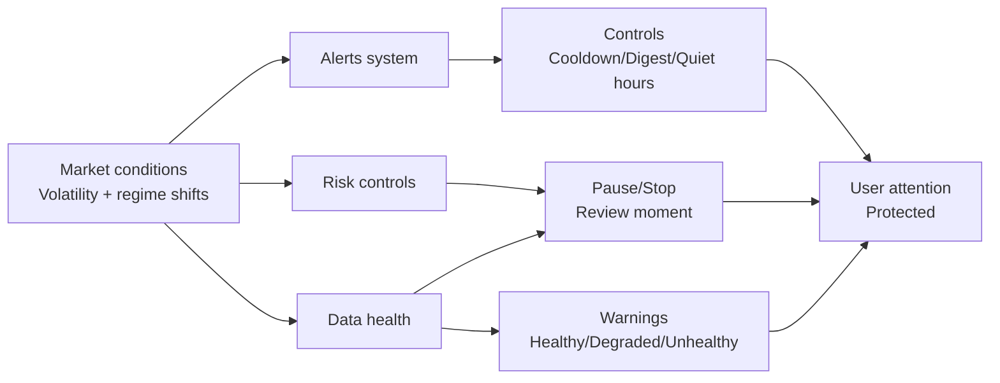

> FUZE treats safety as a product standard because crypto trading risk is real and unavoidable.
> Guardrails create disciplined review moments: drawdown, daily loss, and exposure limits prevent runaway behavior.
> The kill switch keeps the user in control at all times, especially during volatility spikes or uncertainty.
> Perps require extra caution: leverage and liquidation make survival metrics and safety controls non-negotiable.
> Alerts are controlled to prevent spam-driven overtrading, and FUZE never promises profits or certainty.

___

# 9. Execution Module

Execution is where trading becomes real. It is the part of FUZE that can place orders on an exchange and therefore must be treated as a separate trust boundary from analytics and simulation.

FUZE is designed so users can get meaningful value without enabling execution. When execution is enabled, the platform makes the boundary explicit: **Live is Live**, and it never blends into Backtest or Paper.

---

## 9.1 Why execution is separate from proof

FUZE separates execution from proof for one reason: **truth clarity**.

Backtest and Paper are designed to answer:

* “Does this strategy show evidence under explicit assumptions?”
* “How does it behave in real time without risking funds?”

Live execution answers a different question:

* “What happened with real orders and real fills on an exchange?”

These questions cannot share the same scoreboard without misleading users.

### What separation prevents

* Presenting simulation as if it were real trading
* Creating a “track record” that silently mixes historical simulation, paper simulation, and live execution
* Confusing strategy evaluation with operational execution quality

### What separation enables

* Honest comparisons across strategies (Proof layer)
* Clean audit trails for real trading (Execution layer)
* Safer user behavior (paper-first by default, deliberate live activation)

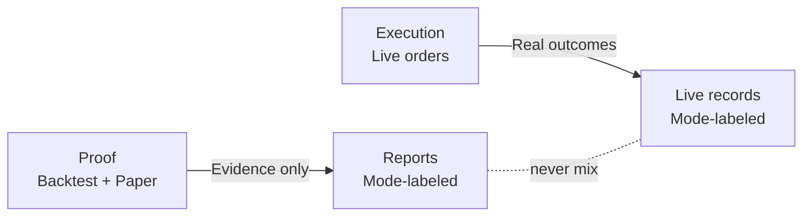

---

## 9.2 BYOK concept

BYOK means **Bring Your Own Keys**—the user controls exchange access.

### What it means in user terms

* The exchange account is yours.
* You decide whether to connect it.
* You decide what permissions it has.
* You can disconnect at any time.

### Why it exists

Execution creates real risk. BYOK ensures:

* users remain the ultimate authority over access
* execution is never “magically enabled”
* responsibility and control stay with the trader

### What users should expect

* A clear connection flow that explains what is being authorized
* Explicit confirmations before anything can place real orders
* Clear visibility that an instance is running in Live mode

---

## 9.3 Reconciliation and trade logs

Once Live execution exists, the platform must be able to explain outcomes clearly—especially when markets move fast.

### Trade log

A trade log is the user-visible record of what the system attempted and what occurred. It exists to answer:

* What was the signal?
* What action was attempted?
* What orders were placed (if any)?
* What fills occurred?
* What is the resulting position and P&L state?

### Reconciliation

Reconciliation means matching:

* **Intent** (what the strategy decided to do)
  with
* **Reality** (what the exchange actually filled)

This matters because in live markets:

* fills can be partial
* prices can move between signal and execution
* orders can be rejected or delayed
* positions can differ from what a simulation would assume

### Why this protects users

* You can diagnose “did the strategy fail, or did execution conditions change?”
* You can verify the platform’s behavior without guessing
* You can support dispute clarity: what happened is recorded

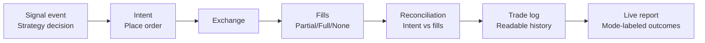

---

## 9.4 Failure handling

Live execution must assume failures will happen sometimes. FUZE treats failure handling as a safety feature, not an edge case.

### Common failure categories (high level)

* Exchange is unavailable or rate-limited
* Market conditions cause wide spreads and slippage
* Order is rejected (constraints, limits, invalid conditions)
* Partial fills occur and leave residual exposure
* Data health is degraded and the platform reduces activity to avoid misleading actions

### How FUZE should behave under failure

When something goes wrong, the platform must do three things:

1. **Protect the user**

* pause or reduce activity when integrity is uncertain
* avoid repeated re-tries that can create unintended exposure

2. **Explain clearly**

* show a simple reason code and what it means
* distinguish “strategy chose not to trade” from “exchange could not execute”

3. **Preserve evidence**

* keep an auditable record so the user can review what happened
* keep Live records separate from Paper and Backtest

### Example “what if” scenarios

* **What if a Live order partially fills and price moves?**
  The trade log must show partial fills, and reconciliation must reflect actual exposure.

* **What if the exchange rejects an order during volatility?**
  The instance should surface the rejection and move into a safe state (pause/review), not silently continue as if nothing happened.

* **What if data becomes unreliable mid-run?**
  FUZE should warn and may pause to avoid acting on degraded inputs.

---

## 9.5 Path from Paper to Live

FUZE is intentionally paper-first. Live execution is a deliberate promotion step, not a default.

### The promotion mindset

Moving to Live is not “turning on profits.” It is accepting a new category of reality:

* real fills
* real risk
* real operational constraints

### What should be true before enabling Live

A user should be confident in these areas:

* **Mode understanding**

  * You know the difference between Backtest, Paper, and Live.
  * You will not interpret Paper as proof of live profitability.

* **Strategy confidence**

  * You have reviewed standardized metrics (especially drawdown and worst week/day).
  * You understand regime behavior and when the strategy tends to break.

* **Operational readiness**

  * You can interpret alerts without panic or overreaction.
  * You understand how to use the kill switch and why pauses happen.

* **Risk readiness**

  * You selected an appropriate risk profile.
  * You accept that Live outcomes can diverge from simulation due to execution realities.

### The promotion flow

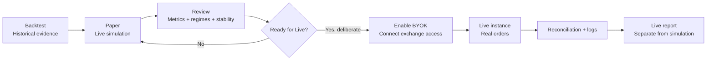

### What FUZE does not allow in this transition

* No silent switching from Paper to Live
* No blending Paper performance into Live track records
* No presenting Live as “guaranteed because Paper worked”

> Execution is a separate truth boundary because real orders create real outcomes and real risk.
> BYOK keeps control with the user and makes Live activation a deliberate choice, not a default.
> Reconciliation and trade logs exist to explain reality: intent is not the same as fills.
> Failure handling is a safety feature—when integrity is uncertain, the system pauses and explains.
> Paper-first remains the recommended path; Live is an optional step taken only after proof and readiness.

___

# 10. Credits Economy and Monetization

FUZE uses a Credits economy to keep the platform simple, scalable, and fair. Instead of hiding costs inside complicated plans, FUZE makes usage explicit: heavy compute and high-frequency operations consume Credits, while light usage stays accessible for new users.

Credits are designed to support three things at once:

* **Trader clarity:** you always understand what you’re paying for
* **Platform integrity:** fair-use limits protect everyone from abuse and noisy behavior
* **Scalable revenue:** usage grows with value delivered, not with hype

---

## 10.1 What Credits are

**Credits** are a platform utility unit used to pay for measurable platform usage.

### Core properties

* **Utility-only:** Credits are used inside FUZE to access and operate features.
* **Non-transferable:** Credits are tied to your account and are not designed as a tradable asset.
* **Ledger-backed:** every mint (add), spend (use), refund, and reversal is recorded so usage remains auditable and disputes are resolvable.
* **Predictable spending model:** Credits are consumed by specific actions that create cost for the platform (compute, runtime, messaging, exports).

### What Credits are not

* Not an investment product
* Not a promise of profitability
* Not a token with price speculation mechanics
* Not a substitute for risk management

### Why Credits exist (in plain terms)

Trading platforms fail when:

* pricing is confusing, causing churn
* heavy users overload the system, degrading everyone’s experience
* the platform cannot afford reliable data and operations

Credits align usage with cost while keeping the product accessible.

---

## 10.2 Stars conversion

FUZE converts **Telegram Stars → Credits** to create a fast, global, trader-friendly payment flow.

### How conversion works

1. You obtain Stars inside Telegram (standard Telegram flow).
2. In the FUZE Wallet screen, you convert Stars into Credits.
3. Credits are added to your balance and recorded in your ledger.

### Why Stars is the right rail for a Telegram-native product

* **Frictionless:** users already understand Stars in Telegram ecosystems
* **Fast:** conversion is immediate and works naturally inside the Mini App
* **Global:** reduces the “payments problem” across countries and currencies
* **Scalable:** supports micro-spending patterns common in active trading tools

### Conversion rule

* **50 Stars = 1 Credit**

---

## 10.3 What Credits pay for

Credits pay for actions that create real platform cost and value. This keeps pricing fair: users who consume more resources pay more, and casual users can stay lightweight.

### Category A: Backtests compute

Backtests consume compute because the platform must:

* process historical windows
* evaluate strategy logic consistently
* generate standardized reports with metrics and regime breakdown

**Typical credit drivers**

* longer historical windows
* higher-frequency timeframes
* more complex evaluation requirements
* repeated iterations (testing multiple strategies or configurations)

### Category B: Paper runtime

Paper simulation consumes runtime because the platform must:

* process live market updates
* generate signals and simulated fills
* maintain instance state and reporting integrity
* monitor safety rules and data health continuously

**Typical credit drivers**

* number of concurrently running paper instances
* duration of runtime (how long you keep instances on)
* frequency of updates and alert events

### Category C: Alerts beyond included quota

Alerts create cost because they require reliable event processing and delivery.

FUZE treats alerts as a controlled system:

* you may have an included baseline alert quota
* beyond that baseline, Credits cover expanded alert delivery

**Typical credit drivers**

* high alert frequency (especially in choppy markets)
* multiple strategies running simultaneously
* advanced alert preferences (more channels, more event types)

### Category D: Exports beyond quota

Exports consume resources because they require:

* generating structured artifacts (reports, summaries, logs)
* packaging data for download or sharing
* maintaining report identity so results remain interpretable outside the app

FUZE uses export gating so the platform can stay fast and reliable for everyone.

### What Credits do not buy

Credits do not buy “better returns.” They buy platform usage: compute, runtime, and delivery.

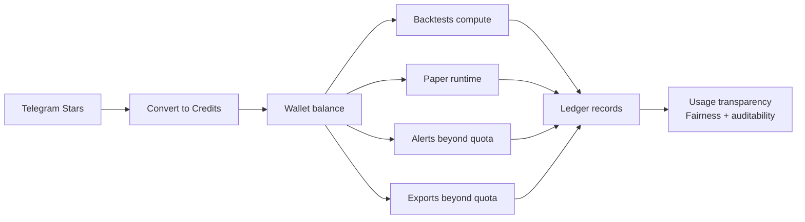

---

## 10.4 Fair-use limits

Fair-use limits exist to protect users and the platform. They prevent abuse, reduce noise, and ensure reliable performance during volatility spikes.

### Why fair-use exists

* **Platform reliability:** unlimited high-frequency usage can degrade performance for everyone
* **Abuse prevention:** prevents spam behavior and exploit patterns
* **Trader protection:** excessive alerts and runaway runs often harm users, not help them
* **Cost alignment:** ensures platform costs remain sustainable and transparent

### What fair-use can control (high level)

* maximum concurrent paper instances
* maximum backtest frequency within a time window
* alert throughput caps (to reduce spam storms)
* export rate limits

### What happens when you reach a limit

FUZE is designed to fail safely and clearly:

* you receive a visible warning before hard limits are hit (where possible)
* the system may **pause** an instance or **delay** non-critical actions
* the UI shows a clear reason (low credits, quota reached, cooldown active)
* nothing is silently “pretended” to work when it cannot

### Low Credits behavior

When Credits are low, FUZE favors protection and clarity:

* instances may pause instead of running into ambiguous states
* critical safety alerts remain prioritized
* you can top up and resume intentionally

This preserves trust: a paused system is better than a misleading system.

---

## 10.5 User levels

FUZE uses **10 user levels** to reward long-term engagement and responsible usage while keeping entry access simple for newcomers.

### What levels do

Levels primarily scale four benefit axes:

1. **Quotas**

* more paper runtime capacity
* more concurrent instances
* higher allowed backtest throughput
* expanded export limits

2. **Cost efficiency**

* a discount mechanism implemented as **bonus credits**
* instead of changing prices constantly, FUZE can grant extra Credits based on level

3. **Priority and stability benefits**

* higher tiers may receive higher service priority during peak load conditions
* ensures committed users maintain a smooth experience

4. **Access progression**

* certain power-user capabilities can be gated behind higher levels to protect safety and integrity

### Discount mechanism: bonus credits

Bonus credits work like a transparent discount:

* you convert Stars into Credits
* based on your level, you receive extra Credits as a bonus
* the ledger records both the paid amount and the bonus amount

This approach keeps pricing understandable:

* you always see what you paid
* you always see what bonus you received
* there is no confusing “hidden fee schedule”

### How to level up

Leveling is designed to encourage healthy platform usage and long-term commitment rather than short-term exploitation.

A level system typically rewards:

* consistent platform activity (running paper instances responsibly)
* sustained engagement (not one-time spikes)
* contribution to ecosystem health (such as behaviors tied to long-term alignment)

FUZE treats leveling as a long-term design tool:

* it should be hard to “game”
* it should be stable and predictable
* it should support retention without encouraging reckless leverage

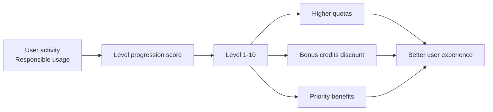

> Credits make FUZE simple to understand: pay for compute, runtime, alerts, and exports—never “pay for profit.”
> Stars-to-Credits keeps payments native to Telegram and frictionless for global traders.
> Fair-use limits protect reliability and prevent spam and abuse, especially during volatile markets.
> Levels scale quotas and cost efficiency through bonus credits while keeping pricing transparent.
> The goal is sustainable growth: clear value exchange, trustworthy operations, and a system that stays fast as usage scales.

___

# 11. Referral Program and Community Growth

FUZE grows through community, but it does not sacrifice trust to do it. The referral program is designed to reward real adoption and real usage—without encouraging spam, misleading marketing, or “fake performance” narratives.

Community growth in FUZE is built on three principles:

* **Proof travels better than hype**
* **Incentives must be reversible when abuse happens**
* **Sharing must stay truthful about mode (Backtest, Paper, Live)**

---

## 11.1 Affiliate model overview

FUZE uses a multi-level referral model designed to be simple for users and predictable for the platform.

### What referrals are for

* Help users invite friends who want a trustworthy way to evaluate strategies
* Reward community members who drive real activation and retention
* Build a distribution loop that stays inside Telegram-native behavior

### Core structure

* **L1 referral:** the user you directly invite
* **L2 referral:** the user invited by your L1 referral

This creates a growth graph that expands naturally while still remaining accountable.

### Who benefits

* **New users:** receive a clear onboarding path and access to paper-first value quickly
* **Referrers:** receive rewards when referrals activate and use the platform legitimately
* **Platform:** acquires users through proof-based sharing and community credibility

---

## 11.2 How payouts work

The goal of payouts is to reward meaningful adoption, not spam clicks.

### High-level payout logic

A referral reward typically depends on events like:

* a new user completes onboarding and becomes active
* the new user converts Stars to Credits
* the new user spends Credits on platform usage (backtests, paper runtime, etc.)

This ensures rewards are tied to real value creation, not vanity metrics.

### Lock and reversal logic

Referral rewards must protect the system from abuse. FUZE therefore treats rewards as:

* **eligible**
* then **locked**
* then **confirmed**

If suspicious or invalid activity occurs, rewards can be:

* reversed
* withheld
* or invalidated

This is not punitive. It is integrity protection.

### Why lock periods matter

Locking prevents two common exploit patterns:

* self-referral loops (creating fake users to farm rewards)
* rapid churn farming (users convert and immediately refund/abandon)

A lock window ensures the user is real and the usage is real.

---

## 11.3 Anti-fraud rules

Referral systems fail when they reward behavior that harms the product. FUZE’s referral system is designed to stay defensible.

### What counts as fraud or abuse (plain language)

* Creating multiple accounts to refer yourself
* Using bots or automated scripts to generate signups
* Misrepresenting results (especially mixing Paper with Live)
* Spamming groups or DMs in a way that violates platform rules or harms community trust
* Incentivizing deceptive behavior (“guaranteed profit,” “risk-free,” etc.)

### How FUZE discourages abuse

The system is designed so that:

* rewards are based on real activation and usage, not clicks
* rewards can be reversed if the activity is suspicious
* leaderboards and sharing surfaces remain report-linked and mode-labeled, reducing misinformation

### Why this matters to investors

Anti-fraud controls protect:

* CAC efficiency (no wasted payouts)
* brand reputation (reducing spam behavior)
* platform integrity (proof stays truthful)

A referral system that is gamed becomes a liability. FUZE treats it as a trust-controlled growth engine.

---

## 11.4 Share-to-earn guidelines

Sharing is allowed and encouraged, but it must remain truthful. FUZE’s growth strategy is based on evidence, not exaggeration.

### What is allowed

* Sharing strategy pages and summaries
* Sharing mode-labeled reports (Backtest or Paper clearly indicated)
* Sharing educational explanations of metrics and regimes
* Sharing your workflow: “I backtested this, then ran paper for a week, here’s what I learned”
* Sharing referral links in appropriate channels where users expect it

### What is not allowed

* Claiming guarantees or “easy profit”
* Posting “profit screenshots” without report identity
* Presenting Paper performance as Live performance
* Hiding risk, drawdown, or worst-week behavior
* Spamming unrelated groups or harassing users with referral messaging

### Why these rules exist

* They protect new users from being misled
* They protect the referrer from building a reputation on hype
* They protect the platform from becoming a spam product

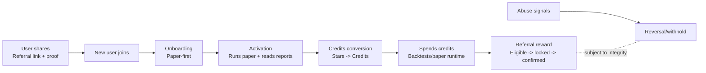

> FUZE uses referrals to grow through community credibility, not spam.
> The model rewards real activation and real usage, not clicks or screenshots.
> Payouts use lock and reversal logic to prevent farming and protect integrity.
> Share-to-earn is allowed when it stays truthful—mode-labeled reports, clear risk, no guarantees.
> The referral engine is designed to compound trust: proof drives adoption, and integrity protects the loop.

___

# 12. Leaderboards and Social Proof

Leaderboards can be powerful, but they can also be dangerously misleading if they reward only ROI. FUZE treats leaderboards as a **trust surface**, not a hype surface.

The goal of FUZE leaderboards is to help users discover strategies and trading styles that are:

* measurable
* comparable
* survivable
* and honestly labeled by mode

---

## 12.1 What the leaderboard measures

FUZE does not treat “highest ROI” as the single measure of quality. A strategy that doubles quickly but suffers brutal drawdowns is often unusable for most traders.

### Trust-first scoring principles

A FUZE leaderboard should incorporate multiple dimensions so users don’t mistake luck for edge:

* **After-fee ROI**
  Still important, but never alone.

* **Max drawdown**
  The key survival metric. Strategies that “win big” but also “die big” should not dominate.

* **Worst day / Worst week**
  Reveals tail risk and fragility.

* **Exposure**
  Helps interpret whether returns came from constant risk-taking or selective entries.

* **Turnover**
  Prevents high-frequency “cost fragile” strategies from looking superior due to unrealistic assumptions.

* **Trade count**
  Helps filter out strategies ranked high due to small sample size.

### What this means in practice

Instead of “Top ROI,” a leaderboard becomes:

* “Top risk-adjusted survivability within a mode”
* “Most consistent across regimes”
* “Best drawdown control”
* “Best for sideways regimes”
* “High turnover strategies (high cost sensitivity)”

This makes the leaderboard useful for real decision-making.

---

## 12.2 Mode separation

Mode separation is non-negotiable because social proof becomes misinformation the moment simulation is implied as live trading.

### How mode separation works in leaderboards

FUZE maintains separate truth categories:

* **Backtest leaderboard** (historical simulation)
* **Paper leaderboard** (live simulation record)
* **Live leaderboard** (real execution record)

Each leaderboard is:

* labeled by mode
* scored within its mode
* not blended into a single “global winner list”

### Why this matters

Backtest winners are not necessarily paper winners. Paper winners are not necessarily live winners. Each mode has different failure modes:

* Backtest: can hide assumptions and overfit
* Paper: can reveal regime mismatch and operational behavior
* Live: includes real fills and real execution constraints

Mixing these would create fake credibility.

```mermaid
flowchart LR
B[Backtest leaderboard\nHistorical] --> U[User]
P[Paper leaderboard\nLive simulation] --> U
L[Live leaderboard\nReal execution] --> U

B -. never mix .- P
P -. never mix .- L
```

---

## 12.3 How entries are validated

A leaderboard is only useful if entries are verifiable. FUZE ties leaderboard entries to report-linked evidence.

### Report-linked validation

Each leaderboard entry must point to a report that includes:

* mode label (Backtest/Paper/Live)
* strategy version identity
* timeframe and window
* cost model assumptions (for simulation modes)
* standard metrics block
* regime breakdown

This prevents leaderboard slots from being “claims.”

### Identity checks

A valid entry requires identity consistency:

* same strategy version (no “silent updates”)
* known market and timeframe scope
* consistent assumptions within the mode

If identity changes, it must create a new track record category.

### Sample size sanity

To prevent “one lucky trade” rankings:

* trade count and runtime windows matter
* entries may require minimum activity thresholds before eligibility

FUZE’s goal is to rank **signal quality and survivability**, not chance.

---

## 12.4 Abuse prevention

Leaderboards attract manipulation. FUZE designs for prevention rather than reacting after trust is damaged.

### Common manipulation patterns (plain language)

* Overfitting a strategy just to top a historical window
* Short-term “spike farming” to capture a leaderboard slot
* Using tiny sample sizes to inflate win rate or ROI
* Mislabeling mode or presenting paper as live
* Exploiting alert or run loops to generate misleading metrics

### FUZE protections (high level)

* **Eligibility rules:** only runs that meet minimum standards appear
* **Anomaly detection:** suspicious patterns are flagged or excluded
* **Exclusions and resets:** if integrity is compromised, entries can be removed
* **No-mixing enforcement:** mode confusion invalidates eligibility
* **Auditability:** the platform can trace how an entry was produced

### Why this matters to community growth

If leaderboards become a casino scoreboard, serious traders leave and the product becomes churn-heavy. Trust-first leaderboards build:

* long-term retention
* higher quality referrals
* healthier community discussion based on evidence

```mermaid
flowchart LR
R[Report\nMode-labeled + identity] --> V[Validation\nEligibility + thresholds]
V --> E[Entry\nLeaderboard slot]
E --> S[Social proof\nDiscover + compare]
S --> A[Adoption\nStart paper runs]
A --> R

X[Abuse attempts] --> D[Detection\nAnomaly rules]
D --> Z[Exclude/flag\nPreserve trust]
Z -. protects .- S
```

> FUZE leaderboards are designed as a trust surface, not a hype scoreboard.
> Rankings consider survivability metrics alongside after-fee ROI so users don’t chase fragile winners.
> Mode separation is strict: Backtest, Paper, and Live leaderboards are distinct truth categories.
> Every entry is report-linked and identity-checked so social proof remains verifiable.
> Abuse prevention protects the community loop—when leaderboards stay honest, growth becomes durable.


___

# 13. Go-To-Market and Distribution

FUZE is designed to win distribution the way traders actually behave: fast, social, and habit-driven. The platform is Telegram-native, proof-first, and community-scaled—so growth is powered by evidence and repeatable loops, not hype spikes.

This section explains FUZE’s go-to-market logic in a way investors can evaluate: channel choice, acquisition loops, community loops, and why monetization can scale with usage.

---

## 13.1 Why Telegram is the channel

Telegram is not just “a chat app” in crypto—it is the default operating layer for:

* communities and alpha discovery
* trader groups and alerts
* bot-driven workflows
* fast sharing and referrals

FUZE chooses Telegram because it matches the product’s behavioral needs.

### Speed and low friction

Traders operate in short attention windows. Telegram-native makes it easy to:

* onboard quickly
* run paper instances immediately
* receive alerts in the same place users already spend time

### Distribution built into the behavior

Telegram supports:

* instant sharing into groups
* direct referrals without switching platforms
* a natural funnel from “see proof” → “try paper” → “continue habit”

### Lower CAC potential through community mechanics

FUZE’s trust-first approach turns community into a scalable acquisition engine:

* leaderboards create discovery without paid ads
* referrals reward genuine adoption and usage
* proof-based sharing reduces skeptical friction

### Retention advantage

If a product becomes part of a trader’s Telegram routine, retention strengthens:

* alerts, check-ins, and monitoring become habitual
* Paper-first flow encourages ongoing usage even before execution is enabled

---

## 13.2 Trader acquisition loop

FUZE’s growth loop is built around how traders adopt tools:

1. they see something interesting
2. they look for evidence
3. they try it safely
4. they repeat if it feels trustworthy

FUZE turns this into a repeatable system.

### The FUZE acquisition loop

* **Signals** attract attention (strategy library and highlights)
* **Proof** earns trust (standardized reports, mode-labeled evidence)
* **Paper** creates habit (real-time simulation without risking funds)
* **Review** reinforces belief (metrics, regimes, survival clarity)
* **Spend** scales value (credits for backtests, runtime, alerts, exports)

```mermaid
flowchart LR
A[Attention\nStrategy discovery] --> B[Proof\nReports + metrics]
B --> C[Try safely\nPaper simulation]
C --> D[Habit\nAlerts + monitoring]
D --> E[Review\nRegimes + drawdown]
E --> F[Spend\nCredits for usage]
F --> D
```

### Why this loop works

* It replaces “trust me” with “verify it yourself.”
* It reduces the biggest adoption barrier: users can start without connecting exchanges.
* It builds repeat behavior: paper instances and review become routine.

---

## 13.3 Community loops

Traders are social learners. FUZE uses community mechanics, but with integrity rules that prevent hype-driven misinformation.

### Loop 1: Referrals (share-to-earn)

* Users share FUZE with friends
* New users onboard quickly into paper-first
* Rewards are tied to real activation and usage, not clicks
* Anti-fraud and reversal logic protect the system

### Loop 2: Leaderboards (social proof with evidence)

* Users discover strategies through rankings
* Rankings are mode-separated and report-linked
* Survival metrics prevent “high ROI, high fragility” strategies from dominating
* This creates higher-quality adoption: users arrive expecting proof, not promises

### Loop 3: Knowledge sharing (exports + reports)

* Users share report-linked evidence in communities
* Shared reports retain identity so they remain interpretable outside the app
* Communities evolve from “signal spam” into “evidence discussion,” which increases trust and retention

```mermaid
flowchart LR
L[Leaderboards\nReport-linked] --> D[Discovery]
D --> P[Paper-first onboarding]
P --> R[Reports\nMode-labeled evidence]
R --> S[Sharing\nGroups + friends]
S --> N[New users]
N --> P

R --> A[Affiliate rewards\nLocked + confirmed]
A --> S
```

---

## 13.4 Monetization model summary

FUZE monetizes in a way that aligns with real usage and real platform cost: the more value users extract (compute + runtime + alerts + exports), the more they spend.

### What users pay for

* Backtests compute
* Paper runtime
* Alerts beyond quotas
* Exports beyond quotas

This is a usage-based system that scales naturally.

### Why this is investor-friendly

* **Predictable scaling:** usage grows with product-market fit, not with speculative narratives
* **Lower barrier to entry:** users can start small and expand as trust builds
* **Fairness:** heavy users pay more, preventing platform degradation and subsidization problems
* **Retention-driven:** the model rewards ongoing usage, not one-time purchases

### Unit economics story (high level)

* Acquisition comes from Telegram-native sharing and proof loops
* Activation is fast because paper-first does not require exchange connection
* Retention strengthens through habit and trust surfaces (alerts + review)
* Monetization increases as users run more instances, backtest more strategies, and use premium quotas

### What makes it defensible

FUZE’s defensibility is not “secret signals.” It is:

* trust standards (mode separation, report identity)
* reproducibility (versioning, consistent metrics)
* integrity controls (leaderboard validation, anti-fraud referrals)
* user habit loop design (paper-first + Telegram-native alerts)

> FUZE’s distribution is built around trader behavior: fast discovery, proof-based trust, paper-first habit, then scaled usage.
> Telegram is the channel because it matches how crypto traders communicate, share, and act in real time.
> Community loops (referrals and leaderboards) accelerate growth, but integrity rules prevent hype-driven misuse.
> Monetization scales with real usage—compute, runtime, alerts, exports—keeping pricing understandable and platform costs sustainable.
> The go-to-market strategy is simple: proof travels, habits compound, and trust creates durable retention.


___

# 14. Roadmap

FUZE’s roadmap is built around one principle: **trust must come first**. The platform scales by expanding proven foundations—standard reporting, mode separation, data health, and safety controls—before adding operationally complex features like live execution and copy trading.

This roadmap is designed to be easy to understand as a public plan: what exists now, what comes next, and what gates must be satisfied before higher-risk modules are introduced.

---

## 14.1 MVP

The MVP is intentionally focused so strategies are comparable and the trust standard is consistent.

### Fixed scope

* Markets: BTC/USDT and ETH/USDT
* Exchanges: Binance and KuCoin
* Instruments: Spot and Perp
* Timeframes: 1h and 5m
* Modes: Backtest and Paper (live execution remains separate and optional)

### Must-have deliverables in the MVP

* Strategy system

  * templates with immutable versions
  * paper instances
  * parameter validation
* Trust reporting

  * standardized metrics (after-fee ROI, max drawdown, worst day/week, exposure, turnover, trade count, win rate)
  * regime breakdown (bull, bear, sideways)
  * report identity that enforces no-mixing
* Backtest capability with realism

  * explicit fees and slippage assumptions
  * minimum viable walk-forward support
  * minimum viable stress-day replay
* Paper simulation capability

  * live candle ingestion
  * simulated fills and ongoing reporting
* Credits economy

  * Stars to Credits conversion
  * ledger visibility and credit burn transparency
  * auto-pause behavior when credits are low
* Community growth surfaces

  * affiliate support
  * leaderboard based on trust metrics with strict mode separation
* Admin operations baseline

  * audit logging
  * data operations (backfill, pause)
  * operational controls for safety intervention

### MVP acceptance outcomes

A user can complete the full loop:

* discover a strategy → run a backtest → create a paper instance → receive alerts → view a report → export results
  And the platform remains safe and accountable:
* credits can be purchased and tracked in a ledger
* paper runs pause clearly on low credits or integrity protections
* admins can diagnose data health and audit actions

---

## 14.2 Next 90 days

The near-term roadmap expands capability while keeping the trust model unchanged. The focus is to broaden coverage and improve decision-making tools without introducing execution complexity prematurely.

### Market expansion

* Add additional high-liquidity perpetual markets beyond BTC and ETH
* Add new timeframes only if data health can maintain alignment and stable latency

### Research and reporting upgrades

* Robustness tools to reduce overfitting risk

  * sensitivity tests for parameter stability
  * optional Monte Carlo or bootstrapped outcome views
* Regime system upgrades

  * enhanced regime classifier while staying deterministic
* Better comparison workflows

  * side-by-side report comparison

### UX upgrades for trader speed

* Strategy watchlist for faster daily workflow
* Contextual “explain this metric” help across the product
* Alert digest customization by timeframe and market
* One-tap replay of worst day or worst week to understand failure modes quickly

---

## 14.3 Data pack expansions

Data packs expand what the platform can explain and measure, especially for perp trading realism and regime understanding.

Planned upgrades include:

* Funding rate ingestion per exchange
* Open interest ingestion per exchange
* Basic liquidity proxies where feasible (such as spread snapshots)
* Exchange session and maintenance window handling (calendar awareness)

Why this matters:

* It improves realism and interpretability for perp results
* It strengthens “what changed” explanations during volatility shifts
* It reduces confusion when outcomes diverge across venues

---

## 14.4 Execution phase

Execution increases operational complexity and user risk. FUZE treats it as a gated phase that can only expand after clear readiness conditions are met.

### Execution readiness gate

Live execution may expand only when the platform can demonstrate:

* stable data health performance with low gap rates and stable latency
* robust reconciliation between intent and actual fills
* tested incident playbooks and reliable operational response
* a proven global kill switch behavior under stress
* audit logs that cover key lifecycle actions and order operations

### Execution model decision

FUZE treats execution as an explicit choice between two models, with clear separation:

* BYOK execution

  * users connect their own exchange keys
  * the platform executes on their behalf
  * simpler than copy trading because it avoids follower fairness complexity

* Copy trading (later)

  * leader/follower relationships and allocation policies
  * fairness, slippage disclosure, and reconciliation per follower
  * higher operational and compliance complexity

A core rule applies even if both exist:

* **each must remain a separate mode with separate reporting**

---

## 14.5 Copy trading

Copy trading is planned as a future module and treated as high-complexity by design. If introduced, it must include protections that make it safe and defensible.

### Allocation and fairness requirements

* Allocation policy options may include

  * fixed percentage of equity
  * fixed notional per trade
  * bounded risk-based sizing
* Slippage disclosure and reconciliation per follower
* Follower protections

  * max drawdown cap
  * max daily loss limit
  * max leverage limits for perps
  * automatic pause during data issues

### Integrity requirements

* Leader track record must remain mode-separated

  * paper leaderboard is not the same as live leaderboard
* Follower outcomes must be labeled clearly as copy live execution
* The platform must store allocation intent and final fills per follower for accountability

---

## 14.6 Long-term vision

Long-term expansions are allowed only if they do not weaken the trust standard.

Potential directions include:

* Strategy marketplace

  * curated and community publishing
  * verified backtests and report-linked ratings
* Public or partner integrations

  * standardized report exports to external tools
  * webhook-style alert delivery
* Ecosystem integrations

  * journaling tools
  * portfolio trackers
  * research notebooks
* Team and enterprise workspaces

  * multi-user environments
  * shared strategy libraries
  * governance workflows for strategy changes and approvals

---

## Phased roadmap view

```mermaid
flowchart LR
A[Phase A\nQuant core + trust] --> B[Phase B\nScale + data packs]
B --> C[Phase C\nExecution hardening]
C --> D[Phase D\nCopy trading]

A --> A1[Backtests + paper\nStandard reports\nData health + auto-pause\nCredits + ledger\nAffiliate + leaderboard\nAdmin ops baseline]
B --> B1[More liquid perps\nFunding + OI packs\nRobustness tools\nLeaderboard integrity upgrades]
C --> C1[Reconciliation maturity\nIncident automation\nOptional paper-to-live promotion]
D --> D1[Leader/follower allocation\nFairness + per-follower reconciliation\nClear labeling + separate scoring]
```

---

## Roadmap governance

FUZE treats roadmap delivery as a trust process, not a feature checklist. Each phase must have a clear completion standard that includes:

* trust integrity checks
* safety rail checks
* billing correctness checks
* load and rate-limit readiness checks

New capabilities should ship behind controlled rollout until validated. If a data incident occurs, the platform must be able to freeze leaderboards and pause paper or live activity to protect integrity.

> FUZE scales in the order that trust demands: proof first, then coverage, then execution, then copy trading.
> The MVP delivers the full trader loop using backtest and paper with standardized reporting and strict mode separation.
> Near-term work expands markets, data packs, and decision tools without weakening safety or integrity.
> Execution is gated by operational readiness; copy trading is future work with strict fairness and labeling rules.
> The long-term vision is a marketplace and integration ecosystem built on verifiable performance, not claims.

___

# 15. Team, Operations, and Governance

FUZE Quant Platform is a trust product. That means the “business” is not only strategies and UX—it’s also **how the platform is operated**, how changes are governed, and how incidents are handled without rewriting history or confusing users.

This section explains the public commitments behind the product: how the platform is run day-to-day, how privileged actions are controlled, and how FUZE stays safe, reliable, and fair as it scales.

---

## 15.1 Team overview

FUZE is operated as a set of clear responsibilities aligned to the platform’s trust boundaries:

### Strategy and reporting stewardship

* Owns the strategy lifecycle: publishing new strategy versions, deprecating old ones, and ensuring change notes are understandable
* Ensures every result is mode-labeled and identity-complete (so reports stay comparable and don’t get mixed)

### Data health and reliability

* Monitors market data quality (healthy / degraded / unhealthy)
* Ensures paper simulation pauses when data integrity is at risk
* Coordinates backfills and time-bounded overrides when data gaps occur

### Safety and integrity

* Oversees guardrails, kill switch readiness, and platform safety behaviors
* Maintains fairness controls across billing, affiliates, and leaderboards
* Prevents integrity violations like misleading performance narratives, abuse loops, or mode confusion

### Operations and user support

* Handles user-facing issues with clear reasons and audit trails
* Resolves billing and ledger disputes with transparent, recorded actions
* Coordinates incident communication inside the app when system health or data health is degraded

**Strength in this structure:** it is designed to protect trust. Strategy changes, data issues, and operational actions all have defined boundaries and records—so the platform remains explainable as it grows.

---

## 15.2 Operating principles

FUZE is run using principles that directly map to user trust.

### Safety first

* The system should prefer pausing and explaining over “continuing silently”
* High-risk capabilities (especially live execution) must have stronger controls and faster shutdown paths

### Trust is a standard, not a claim

* Reports are structured so users can verify what happened
* Results stay mode-separated and identity-labeled, even when shared outside the app

### Fairness by design

* Billing must be accurate and auditable
* Affiliates and leaderboards must be protected against manipulation
* Heavy usage should not degrade the experience for others (fair-use limits and controlled resources)

### Least privilege for privileged actions

* Admin access is role-based and scope-based
* No one is “all-powerful by default”
* Every privileged action leaves an immutable record

### Preserve history

* Strategy versions are immutable once published
* Deprecation blocks new runs but does not delete history
* Reports are immutable; integrity actions attach flags/exclusions rather than altering metrics

---

## 15.3 Admin oversight

Admin oversight exists to keep the platform safe, reliable, trustworthy, and fair—without compromising report integrity.

### Role-based access control

FUZE uses two minimum roles:

* **User**
* **Admin**

Admins are **scoped**. “Admin” is not a single master key.

### Scoped permissions

Admin permissions are separated by responsibility areas such as:

* user support actions
* billing and ledger controls (high risk)
* affiliate operations (release, hold, revoke)
* leaderboard moderation (exclusions and integrity actions)
* strategy governance (publish, deprecate, block)
* report integrity actions (flag, freeze, exclude—never edit metrics)
* data health operations (backfill, pause/resume feeds)
* execution operations (force stop/flatten, global pause controls)

### Audit logs for every privileged action

Every admin change writes an immutable audit record, including:

* who performed the action
* what scope(s) authorized it
* what changed (redacted diffs where necessary)
* why it was done (reason code + optional note)
* when it happened (and trace context)

### What admin oversight does not do

* It does not rewrite results
* It does not “fix” performance reports by editing metrics
* It does not hide incidents—integrity actions are recorded and user communication is required when impact exists

---

## 15.4 Incident transparency

Trading systems must assume incidents will happen: exchange outages, data gaps, rate-limit events, and performance degradation. FUZE treats incident handling as part of the product.

### Severity model

FUZE categorizes incidents so responses are predictable:

* **Live trading unsafe** (highest urgency)
* **Data integrity degraded** (simulation and reporting confidence affected)
* **Performance degradation** (delays, backlog, reduced responsiveness)
* **Minor issues**

Each level defines:

* who is responsible to act
* immediate safety actions (pause, feature controls, backfill)
* user communication requirements

### Automated user protection during incidents

The platform is designed to auto-protect:

* pause paper instances when data is missing or stale
* pause billing actions when job failures could cause incorrect charging
* pause live execution when repeated errors indicate unsafe conditions
* optionally freeze leaderboards during data incidents to prevent misinformation

### User communication inside the app

When system health or data health is degraded, users will see a clear banner stating:

* what is impacted (paper, live, reports)
* what actions were taken (auto-pauses, global pauses)
* what the user should do (wait, review, resume later when stable)

### “What if” scenarios users care about

* **What if data gaps occur during paper simulation?**
  Paper pauses, the reason is shown, and results are not presented as normal-quality evidence.
* **What if live trading becomes unsafe due to an exchange incident?**
  A global pause capability exists, and the incident is logged with clear operational actions.
* **What if leaderboards could be distorted by an incident?**
  Leaderboards can be frozen or entries excluded with attached reason codes, rather than silently continuing.

```mermaid
flowchart LR
A[Issue detected\nData/Exchange/System] --> B{Impact level}
B -->|Live unsafe| C[Global pause for live]
B -->|Data degraded| D[Pause paper + warn]
B -->|Performance| E[Reduce load + stabilize]
C --> F[User banner\nImpact + actions + guidance]
D --> F
E --> F
F --> G[Incident log\nAuditable record]
G --> H[Post-incident\nUnfreeze + restore + notes]
```

---

## 15.5 Governance

Governance is how FUZE changes the product without weakening trust.

### Strategy version governance

* Publishing a new strategy version requires:

  * change notes
  * declared supported markets and timeframes
  * declared cost model compatibility
  * validation checks that prevent obvious integrity failures
* Versions are immutable once published
* Deprecation blocks new instances but preserves history and reports
* Blocking is reserved for integrity violations or safety issues

### Report integrity governance

* Reports are immutable
* Admins may:

  * flag a report as invalid (example: data corruption)
  * exclude it from leaderboards
  * attach an incident note and reason code
* Admins may not:

  * edit metrics
  * rewrite outcomes
  * blend modes or identities to “smooth” a track record

### Live execution governance

Live is higher risk and therefore has stricter governance:

* a global pause capability must exist for live order placement
* high-impact controls (stop/flatten actions) are restricted and auditable
* key handling and order intent visibility must remain auditable at a governance level

### Governance acceptance standard

FUZE considers governance “working” when:

* safety actions can be taken quickly and are auditable
* strategy versions and reports remain immutable and trackable
* affiliate holds/revokes and leaderboard exclusions are reproducible with clear reasons
* data health overrides are time-bounded and logged
* new features ship behind controlled rollout until validated, and incidents can freeze leaderboards and pause paper/live when needed

> FUZE is operated like a trust system: scoped admin access, immutable reports, and auditable actions.
> Strategy versions are governed so history is preserved—changes create new versions, not rewritten results.
> Incidents are handled with auto-protection and clear user communication, not silent failure.
> Leaderboards and affiliates are managed with integrity controls and reversible actions when abuse is detected.
> The platform’s governance is designed to scale trust first, then features.


___

# 16. Legal, Privacy, and Compliance

FUZE Quant Platform is a trust-first trading platform. That means legal, privacy, and compliance are not afterthoughts—they are part of the product boundary. FUZE is built to help users evaluate and operate strategies with clarity, while keeping responsibilities explicit and avoiding misleading positioning.

This section explains what FUZE stores, why it stores it, how long it keeps it, and how FUZE positions the difference between signals and execution.

---

## 16.1 Privacy summary

FUZE collects and stores only what is necessary to operate the product reliably, enforce trust standards, and keep users safe.

### What FUZE may store

* Account identity needed to use the platform inside Telegram
* User preferences and settings (alerts, quiet hours, risk profile choices)
* Strategy run records

  * which strategy version was used
  * which mode the instance ran in
  * lifecycle events (start, pause, resume, stop) and pause reasons
* Reports and report identity metadata

  * mode label, strategy version, timeframe, cost assumptions
  * regime breakdown metadata
* Data health states and incident annotations relevant to integrity
* Credits balance and ledger records

  * conversions, spends, refunds, reversals
* Referral and affiliate records

  * eligibility status, holds, confirmations, reversals
* Leaderboard validation records

  * eligibility checks, exclusions, anomaly flags
* Audit logs for privileged actions and integrity operations

### What FUZE is designed not to store unnecessarily

* It does not need to store unrelated personal data to deliver value
* It avoids collecting sensitive identity attributes that are not needed for platform operation
* It does not require users to provide exchange access to use Backtest or Paper

### Why FUZE stores this data

* To provide standardized reporting and prevent mixing results
* To enforce safety rules and explain auto-pauses
* To support billing accuracy and resolve disputes via ledger records
* To prevent abuse in referrals and leaderboards
* To maintain auditability and operational accountability

---

## 16.2 Data retention basics

Retention exists for two reasons:

* Users need continuity (reports, history, comparisons)
* The platform needs integrity (auditability, dispute resolution, abuse prevention)

### Retention categories (high level)

* **Reports and report identity**

  * retained to support user review and comparability over time
* **Instance lifecycle and trade/event records**

  * retained to explain outcomes and pause reasons
* **Credits and ledger records**

  * retained for billing transparency and dispute resolution
* **Affiliate and leaderboard integrity records**

  * retained to detect abuse patterns and support reversals fairly
* **Audit logs**

  * retained to prove what privileged actions occurred and why

### Public retention principle

FUZE retains data only as long as necessary to:

* provide user history and comparability
* satisfy integrity and auditability needs
* comply with applicable obligations where required

FUZE treats retention as a governance-controlled policy:

* changes to retention behavior require stricter review because they impact trust and user rights

---

## 16.3 Signals vs execution positioning

FUZE draws a clear line between analysis/simulation and real trading. This line is critical for responsible positioning and user clarity.

### Signals and simulation (Backtest and Paper)

Backtest and Paper are designed as research and evaluation tools:

* They help users understand strategy behavior
* They provide mode-labeled evidence under explicit assumptions
* They do not place real orders

This positioning supports:

* clearer user expectations
* reduced risk of misleading users
* a safer public narrative: “verify and learn before risking funds”

### Execution (Live)

Live execution places real orders and therefore has additional responsibilities:

* user-controlled exchange access
* stronger safety controls
* reconciliation and audit trails
* clearer user confirmations and mode labeling

FUZE’s positioning rule:

* The platform never implies execution is part of the proof layer
* Live performance is a separate truth category and never merged with simulation

### Why this matters

This separation:

* reduces user harm caused by mode confusion
* helps avoid misleading marketing claims
* supports compliance-aware growth as the product expands into higher-risk features

---

## 16.4 User responsibilities and limitations

FUZE is designed to be clear about what the platform does and what the user is responsible for.

### User responsibilities

* You are responsible for your trading decisions and risk tolerance
* You should understand the difference between Backtest, Paper, and Live
* You should review survival metrics (drawdown, worst week/day) and regime breakdowns, not only ROI
* If you choose to enable Live execution, you are responsible for:

  * exchange account security
  * understanding leverage and liquidation risk (for perps)
  * monitoring activity and using the kill switch when needed

### Platform limitations

FUZE does not:

* provide financial advice
* guarantee profits
* eliminate trading risk
* promise that simulation will match live fills
* promise uninterrupted availability of exchanges or market data feeds

### Important safety expectations

* Paper-first is recommended because it reduces mistakes and mode confusion
* Data health warnings should be respected—degraded data reduces confidence
* High leverage increases liquidation risk and can erase capital quickly

```mermaid
flowchart LR
U[User] --> M[Chooses mode\nBacktest/Paper/Live]
M --> B[Backtest\nHistorical simulation]
M --> P[Paper\nLive simulation]
M --> L[Live\nReal execution]

B --> R1[Simulation evidence\nExplicit assumptions]
P --> R2[Simulation evidence\nOperational observation]
L --> R3[Real outcomes\nReconciliation + logs]

R1 -. never mix .- R2
R2 -. never mix .- R3

U --> S[User responsibility\nDecisions + risk]
L --> K[User-controlled access\nBYOK]
```

> FUZE is designed to be clear and responsible: simulation and execution are separate truth boundaries.
> Privacy and retention exist to support safety, auditability, billing correctness, and trust integrity.
> Reports and ledgers must remain comparable and explainable over time, which requires structured records.
> FUZE does not give financial advice or guarantees; users remain responsible for decisions and risk.
> The most important compliance idea is simple: verify in simulation, choose execution deliberately, and never mix results.


___

# 17. FAQs

## 17.1 Is this a trading bot

FUZE Quant Platform is a **Telegram-native quant platform** for **research, paper simulation, and (optionally) execution**—built with strict trust boundaries.

* **Backtest** is historical simulation with explicit cost assumptions.
* **Paper** is real-time simulation driven by live market data with simulated fills and accounting.
* **Live** is real execution that can place orders on an exchange using user-provided credentials.

Most users can start and get value **without Live**. FUZE is designed to make performance **verifiable** and **mode-labeled**, not to sell “magic signals” or guarantee profit.

---

## 17.2 Why paper-first

Paper-first exists to protect users from the most common failure pattern in trading products: confusing simulation for reality.

Paper-first helps you:

* **Validate behavior in today’s market** without risking funds
* See how a strategy behaves in real-time volatility and regime shifts
* Build the habit of reading **drawdown, worst week/day, exposure, turnover**—not only ROI
* Catch operational issues early (data health degradation, alert noise, risk triggers)

FUZE treats Paper as the recommended bridge between “looks good historically” and “ready for real execution.”

---

## 17.3 How are results calculated

FUZE results are calculated using a consistent reporting standard so strategies are comparable and not dependent on screenshots or storytelling.

### Mode determines the truth category

* **Backtest:** replays historical data and simulates decisions and fills under explicit assumptions.
* **Paper:** uses live market data and simulates fills and accounting in real time.
* **Live:** uses actual exchange execution and real fills.

### Core rules that keep reports trustworthy

* **Mode separation:** Backtest, Paper, and Live are never merged into one performance record.
* **Version separation:** a strategy version has its own independent track record; changing logic creates a new version.
* **Cost model separation:** results are not merged across different cost assumptions.

### What every report is designed to show clearly

* After-cost return context (so “ROI” is not fantasy)
* Survival metrics (max drawdown, worst day/week)
* Exposure and turnover (how much risk and how much trading friction)
* Trade count and win rate (with sample-size clarity)
* Regime behavior (bull, bear, sideways)

**Important:** past performance is evidence, not a promise. Even the best-looking report can fail in a new regime.

---

## 17.4 What happens if data is missing

FUZE treats data integrity as a safety feature.

When market data becomes unreliable (examples: stale updates, candle gaps, exchange degradation), FUZE is designed to:

* **Mark data health clearly** (healthy / degraded / unhealthy)
* **Warn you inside the product**
* **Auto-pause running instances** when defined integrity thresholds are breached
* Show a **visible pause reason** so you know it was protection, not mystery behavior

This prevents a dangerous outcome: continuing simulation as if it were trustworthy when inputs are not.

---

## 17.5 Can I connect my exchange

Yes—**but it depends on mode.**

* **Backtest and Paper** do **not** require exchange keys and do **not** place real orders.
* **Live** execution (when enabled) uses user-provided exchange access and can place real orders.

FUZE is intentionally designed so you can:

1. evaluate strategies (Backtest)
2. observe real-time behavior safely (Paper)
3. only then decide whether you want Live execution

If you never enable Live, you can still use FUZE as a serious research and paper simulation platform.

---

## 17.6 How do credits work

Credits are **utility credits** used to pay for platform usage that consumes real resources (compute, runtime, delivery). They are designed to be transparent and auditable.

### Buying credits

* Credits can be purchased via Telegram Stars.
* **50 Stars = 1 Credit**

### What credits are used for

Credits are consumed by features that create measurable platform cost, such as:

* Backtests compute
* Paper runtime
* Alerts beyond included quota
* Exports beyond included quota

### Ledger and transparency

FUZE tracks credits with a ledger so you can see:

* credits added from purchases
* credits spent by feature
* limits and quotas that affect your usage experience

### Levels and long-term alignment

FUZE includes **10 levels** designed for long-term use. Level progression is built to discourage short-term farming and reward sustained, healthy usage over time (including active-month requirements at higher tiers).

---

## 17.7 How do referrals work

FUZE referrals are designed to reward real adoption while preventing spam and abuse.

### Two-layer model

* **Layer 1:** direct referrer earns **20%** of the new user’s base credits minted from Stars
* **Layer 2:** upstream referrer earns **5%** of the new user’s base credits minted from Stars

### Eligibility window

Commissions apply only within a bounded window:

* the first **90 days** after the referred user’s first paid invoice, **or**
* the first **3 invoices**, whichever comes first

### Binding rules

Referrals must be attached early to prevent manipulation:

* can be attached only once per new user
* bound on first login or within a limited signup window
* must be before the first paid invoice

### Payout form and reversals

* Affiliate commission is paid in **Credits**
* If an invoice is reversed or fraud-flagged, the related commission is revoked before payout
* Rate limits and anti-abuse constraints exist to prevent farming and self-referral

---

## 17.8 Backtest vs Paper vs Live trust

There is no single “best” mode—each answers a different question. FUZE’s trust model is about **using the right evidence for the right decision**.

### Backtest

Use it to learn:

* historical behavior, drawdown patterns, and regime sensitivity
* whether results depend on one market condition
* whether turnover suggests fragility to costs

**Trust it for:** structure and historical risk behavior
**Do not trust it for:** “this will happen again”

### Paper

Use it to learn:

* how the strategy behaves in the current market in real time
* whether alerts, pacing, and risk controls feel survivable
* whether the strategy is stable under today’s volatility and data realities

**Trust it for:** present-regime observation and operational confidence
**Do not trust it for:** “guaranteed live profit”

### Live

Use it to learn:

* what actually happened with real orders, real fills, and real execution constraints

**Trust it for:** real trading outcomes and audit clarity
**Do not trust it for:** “risk is gone”—Live includes the most real-world uncertainty.

```mermaid
flowchart LR
A[Backtest\nHistorical simulation] --> B[Paper\nReal-time simulation]
B --> C[Live\nReal execution]

A --> A1[Learn behavior\nDrawdown + regimes]
B --> B1[Validate today\nOps + safety + pacing]
C --> C1[Confirm reality\nFills + logs + outcomes]

A -. never merge .- B
B -. never merge .- C
```

---

> FUZE is built around verifiable evidence, not promises.
> Backtest teaches historical behavior, Paper validates today’s reality safely, and Live confirms real execution outcomes.
> Modes never mix, strategy versions don’t rewrite history, and cost assumptions stay explicit.
> If data is unreliable, the platform pauses and explains—trust is preserved by refusing to pretend.
> The safest path is simple: learn → observe → decide, with clarity at every step.


__


# 18. Appendix

This appendix is a practical toolkit: definitions, report reading aids, example journeys, a reusable Trust Snapshot layout, and a public change log format. It’s designed so readers can interpret FUZE outputs consistently—without guessing what a term or report section means.

---

## 18.1 Glossary

### Core truth boundaries

* **Mode**: The truth category for behavior and results. FUZE uses three modes: Backtest, Paper, Live.
* **Backtest**: Historical simulation over past market data using explicit cost assumptions. Useful for learning behavior across regimes.
* **Paper**: Real-time simulation driven by live market data with simulated fills and accounting. Useful for validating behavior safely in the current market.
* **Live**: Real execution that can place orders on an exchange. Outcomes reflect real fills and operational constraints.

### Strategy objects

* **Strategy Template**: A packaged strategy concept presented to users with metadata and defaults (what it is, what it targets, how it behaves).
* **Strategy Version**: An immutable snapshot of a strategy’s logic and parameters. Results and track record belong to the version, not just the template name.
* **Instance**: Your personal run of a specific strategy version in a specific mode, using a selected risk profile.

### Reporting and trust

* **No-Mixing Rule**: Results must not be merged across modes, strategy versions, or different cost assumptions. Mixing creates misleading performance narratives.
* **Report**: A standardized performance record for a specific strategy version, mode, window, and assumptions.
* **Report identity**: The “passport” that tells you exactly what the report represents (mode, version, markets, timeframes, window, cost assumptions, and other identity fields).
* **Trust Snapshot**: A compact, one-page summary layout that highlights identity, survival metrics, regime behavior, and key assumptions for fast evaluation.

### Metrics (common terms)

* **After-fee ROI**: Return after applying the cost model assumptions. This is never shown alone; it must be read alongside survival metrics.
* **Drawdown**: A decline from a previous peak in equity.
* **Max drawdown**: The largest peak-to-trough decline in the report window.
* **Worst day / Worst week**: The worst single-day and single-week outcome in the report window—used to surface tail risk.
* **Exposure**: How often/how much the strategy is at risk in the market.
* **Turnover**: How much trading activity occurs (how frequently positions change). High turnover increases cost sensitivity.
* **Win rate**: The fraction of closed trades that are profitable after costs.
* **Trade count**: Number of closed trades in the window (a sample-size sanity check).

### Market condition terms

* **Regime**: A labeled market condition category—Bull, Bear, Sideways—used to understand when a strategy tends to work or fail.
* **Regime breakdown**: A table that shows key metrics by regime, revealing dependency on specific market conditions.

### Safety and integrity

* **Risk profile**: A behavior preset (conservative/medium/aggressive) that changes how an instance behaves under risk constraints.
* **Guardrails**: Built-in limits like drawdown, daily loss, and exposure constraints that pause or stop instances to force review moments.
* **Kill switch**: An immediate stop/pause control that lets the user halt activity quickly.
* **Data health**: A quality indicator for market data feeds and integrity inputs.

  * **Healthy**: reliable, timely
  * **Degraded**: delayed or partially missing
  * **Unhealthy**: unreliable enough to invalidate simulation confidence
* **Pause reason**: A clear explanation shown when an instance pauses (risk trigger, data health issue, quota/credits, user action).

### Execution (when Live is enabled)

* **BYOK**: Bring Your Own Keys. Users control exchange access and permissions.
* **Trade log**: A readable history of what was attempted and what happened.
* **Reconciliation**: Matching strategy intent to actual exchange fills (especially important with partial fills and volatility).

### Credits and monetization

* **Stars**: Telegram’s native purchase unit used for conversion inside the Mini App.
* **Credits**: Non-transferable utility credits used to pay for measurable platform usage.
* **Ledger**: Immutable record of Credits minted, spent, refunded, and reversed.
* **Quota / fair-use limits**: Limits that protect reliability and prevent abuse (instances, alerts, exports, backtest throughput).
* **Level**: One of 10 tiers that scales quotas and benefits (including bonus-credit discounts).

### Community growth

* **Referral / affiliate**: Share-to-earn program with multi-layer rewards (L1/L2), protected by lock and reversal rules.
* **Leaderboard**: Discovery surface derived from eligible, validated reports, always mode-separated.

---

## 18.2 Example report walkthrough

Below is an illustrative example layout showing how to read a FUZE report quickly and correctly. Values are **examples** only.

### A) Identity block (read this first)

| Field            | Example                             |
| ---------------- | ----------------------------------- |
| Mode             | Paper                               |
| Strategy version | V2 (immutable)                      |
| Markets          | BTC/USDT, ETH/USDT                  |
| Venue scope      | Binance, KuCoin                     |
| Instrument scope | Perp                                |
| Timeframes       | 5m (signals), 1h (regime reference) |
| Window           | 2026-01-01 → 2026-01-05             |
| Cost assumptions | Fees + slippage + spread            |
| Data health      | Healthy (no gaps)                   |

**How to interpret**

* If the mode is Paper, treat outcomes as simulation evidence, not real execution.
* If the version changes, you are reading a different truth category—even if the strategy name looks the same.

### B) Standard metrics block (survival before ROI)

| Metric        | Example |
| ------------- | ------: |
| After-fee ROI |   +8.4% |
| Max drawdown  |   -6.1% |
| Worst day     |   -3.0% |
| Worst week    |   -4.7% |
| Exposure      |     38% |
| Turnover      |    High |
| Win rate      |     54% |
| Trade count   |     128 |

**How to interpret**

* High ROI with high turnover demands caution: small cost differences can flip results.
* Worst day/week tells you whether this is psychologically survivable, not just profitable.

### C) Regime breakdown (detect dependency)

| Regime   | Time share | After-fee ROI | Max DD | Trades |
| -------- | ---------: | ------------: | -----: | -----: |
| Bull     |        42% |         +9.1% |  -3.8% |     60 |
| Bear     |        28% |         -1.2% |  -4.9% |     31 |
| Sideways |        30% |         +0.5% |  -2.7% |     37 |

**How to interpret**

* Strong bull + weak bear often means regime dependency.
* Sideways performance matters greatly for active strategies; chop is where many fail.

### D) Curves and notes (what to look for)

* **Equity curve**: Is growth steady or driven by one spike?
* **Drawdown curve**: Are there long recovery periods?
* **Event markers**: Do worst days cluster around volatility spikes?

### E) Quick decision checklist (in plain reading order)

1. Mode label
2. Max drawdown + worst week/day
3. Regime breakdown
4. Exposure + turnover
5. Trade count and stability over time

---

## 18.3 Example user journeys

### Journey 1: New trader (learn and verify)

1. Open **Strategies** → browse strategies and read trust summaries
2. Open **Lab** → run a backtest and learn the metrics and regimes
3. Start **Paper** from the strategy page
4. Monitor **Home** → watch status, data health, and risk flags
5. Review **Reports** → focus on drawdown and worst week/day first
6. Use **Exports** for journaling (optional)

### Journey 2: Active trader (fast alerts with control)

1. Open **Home** → check instance status and risk flags
2. Open **Run** → manage paper instances (pause/resume/stop)
3. Configure **Alerts** → instant for critical, digest for routine
4. Review **Reports** daily → watch regime shifts and turnover sensitivity
5. If volatility spikes → use **Kill switch** and review pause reasons

### Journey 3: Power user / semi-pro (compare, journal, scale)

1. Maintain a shortlist in **Strategies**
2. Run backtests in **Lab** for multiple versions and compare identity blocks
3. Run multiple paper instances with clear risk profiles
4. Export reports for journaling and community discussion
5. Use **Wallet** → manage Credits, levels, and quotas to scale responsibly

```mermaid
flowchart LR
A[Discover\nStrategies] --> B[Verify\nLab Backtest]
B --> C[Observe\nPaper Run]
C --> D[Operate\nAlerts + Controls]
D --> E[Review\nReports + Regimes]
E --> F{Decision}
F -->|Continue| C
F -->|Switch strategy| A
F -->|Optional later| G[Enable Live\nDeliberate step]
```

---

## 18.4 Trust Snapshot template

Use this as a one-page, shareable layout that preserves identity and prevents misleading “performance screenshots.”

### Trust Snapshot

**Strategy**: `<Strategy Name>`
**Version**: `<Version ID>`
**Mode**: `<Backtest | Paper | Live>`
**Window**: `<Start Date> → <End Date>`
**Markets**: `<BTC/USDT, ETH/USDT, ...>`
**Venue scope**: `<Binance, KuCoin, ...>`
**Instrument scope**: `<Spot | Perp>`
**Timeframes**: `<5m signals / 1h baseline>`
**Cost assumptions**: `<Fees + slippage + spread>`
**Data health**: `<Healthy | Degraded | Unhealthy>`

#### Summary metrics

| Metric        |            Value |
| ------------- | ---------------: |
| After-fee ROI |          `<...>` |
| Max drawdown  |          `<...>` |
| Worst day     |          `<...>` |
| Worst week    |          `<...>` |
| Exposure      |          `<...>` |
| Turnover      | `<Low/Med/High>` |
| Win rate      |          `<...>` |
| Trade count   |          `<...>` |

#### Regime breakdown

| Regime   | Time share | After-fee ROI |  Max DD |  Trades |
| -------- | ---------: | ------------: | ------: | ------: |
| Bull     |    `<...>` |       `<...>` | `<...>` | `<...>` |
| Bear     |    `<...>` |       `<...>` | `<...>` | `<...>` |
| Sideways |    `<...>` |       `<...>` | `<...>` | `<...>` |

#### Notes and boundaries

* **What this is**: `<Explain what the mode means in one sentence>`
* **What this is not**: `<No guarantees / not financial advice / not mixed>`
* **Key risks visible here**: `<Drawdown / worst week / turnover sensitivity>`
* **Integrity flags**: `<Any pauses, data issues, anomalies, exclusions>`

---

## 18.5 Change log

Public releases should be tracked in a way that preserves trust. The change log is **append-only**: it explains what changed without rewriting past results.

### Change log entry format

**Version**: `<vX.Y>`
**Release date**: `<YYYY-MM-DD>`
**Highlights**:

* `<What shipped in one line each>`

**Trust-impacting changes** (must be explicit):

* Mode labeling changes: `<none | describe>`
* Reporting metrics changes: `<none | describe>`
* Regime classifier changes: `<none | describe>`
* Cost assumptions changes: `<none | describe>`
* Strategy version changes: `<new versions published / deprecated versions / blocked versions>`

**Coverage changes**:

* Markets added/removed: `<...>`
* Venues added/removed: `<...>`
* Instruments added/removed: `<...>`
* Timeframes added/removed: `<...>`

**Safety and integrity changes**:

* Guardrails updates: `<...>`
* Data health rules updates: `<...>`
* Leaderboard eligibility updates: `<...>`
* Referral/affiliate rule updates: `<...>`

**Known issues**:

* `<Short, actionable notes>`

**Compatibility note**:

* If any trust-impacting field changes, reports remain valid for their identity, but comparisons must respect the updated identity rules.

---

> The appendix exists to keep FUZE interpretable at scale: shared definitions, consistent report reading, and reusable templates.
> Trust begins with identity: mode, version, window, and assumptions must be visible before any metric is trusted.
> Survival metrics and regimes are the fastest way to detect fragility and dependency.
> Trust Snapshots prevent misleading sharing by preserving the report passport and boundaries.
> Public change logs are append-only so progress never rewrites history.


